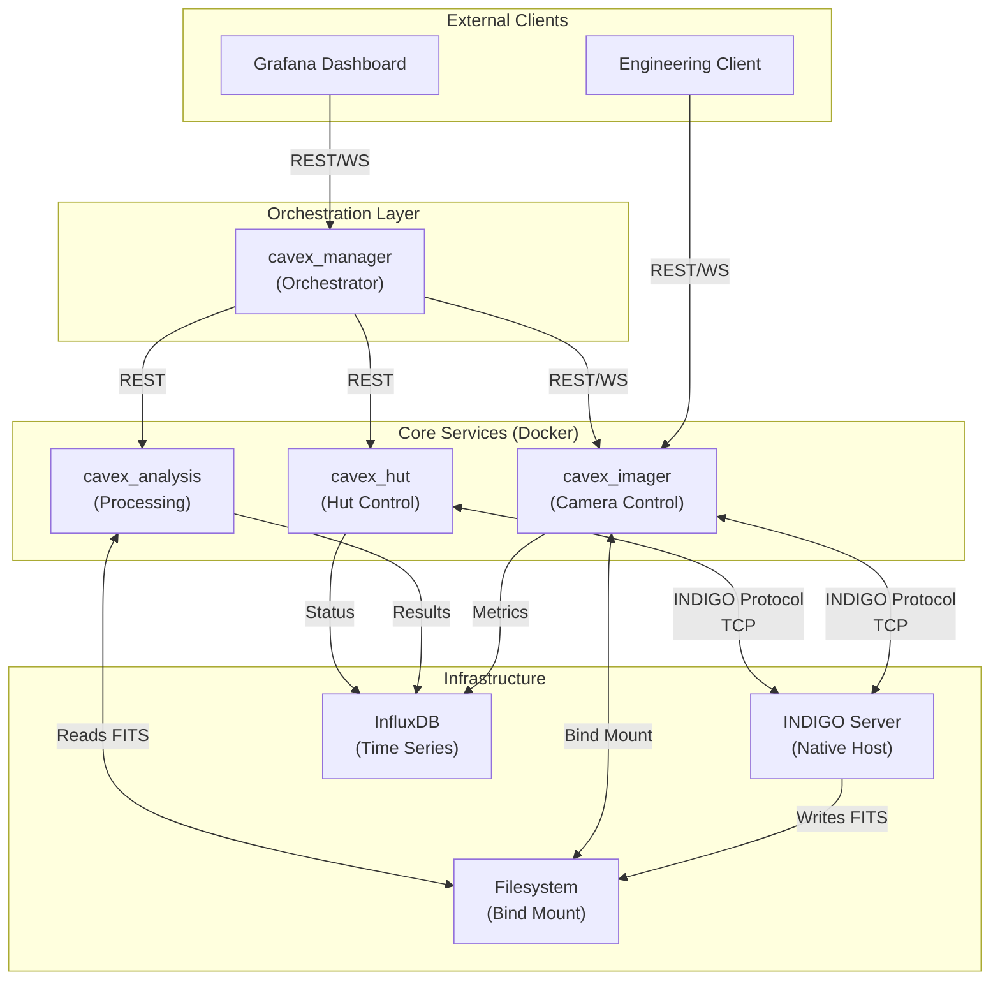
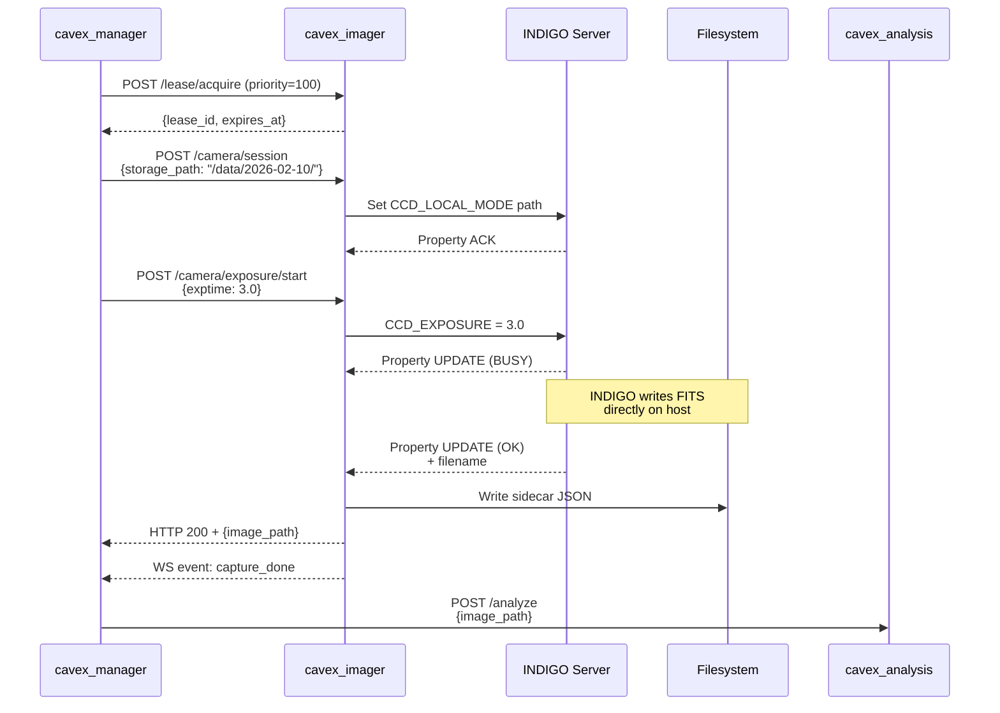
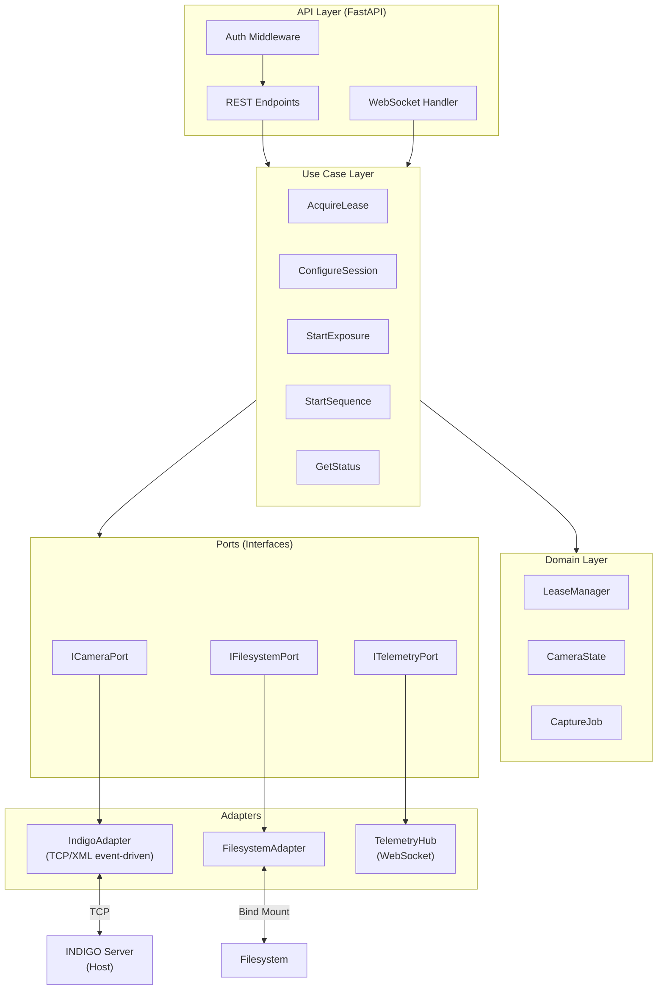
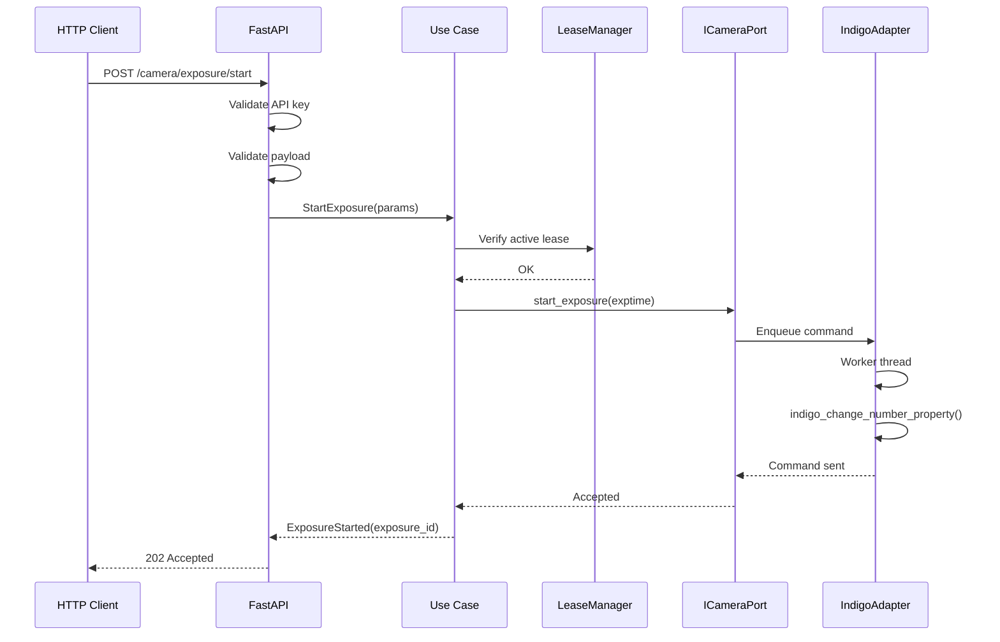
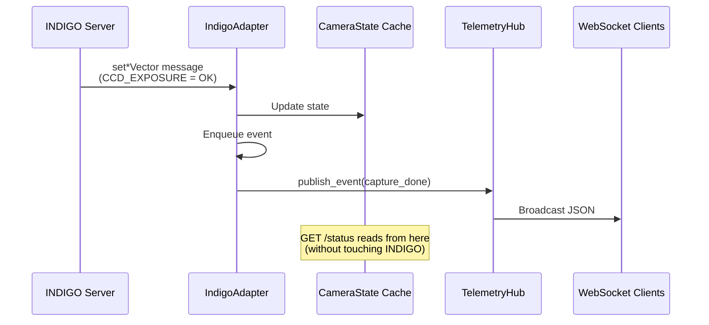
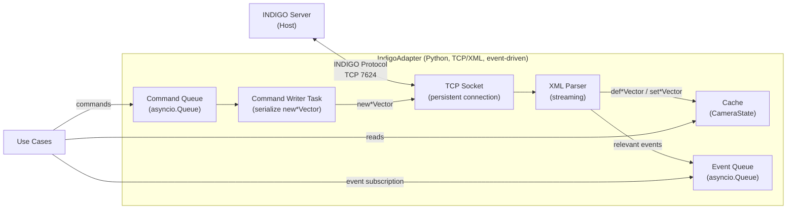
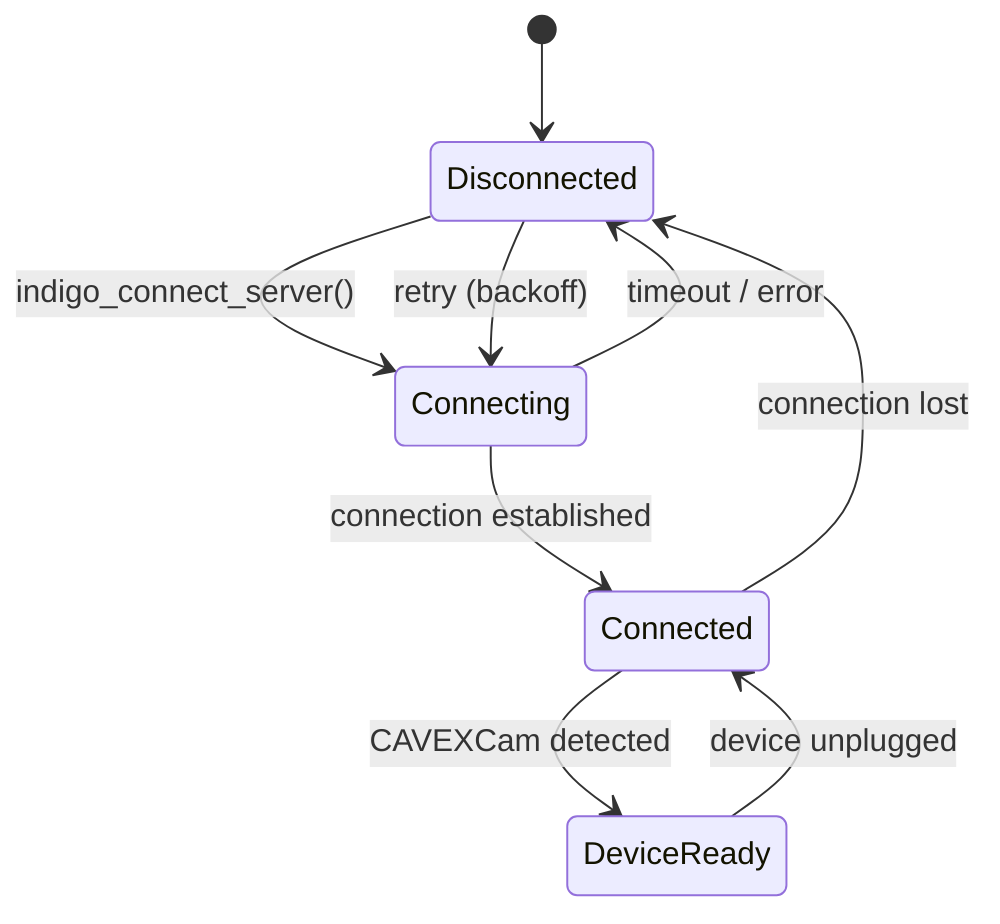
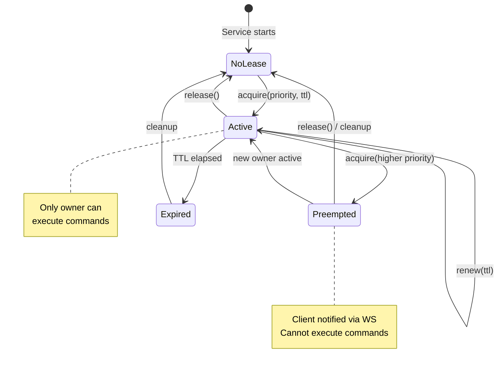
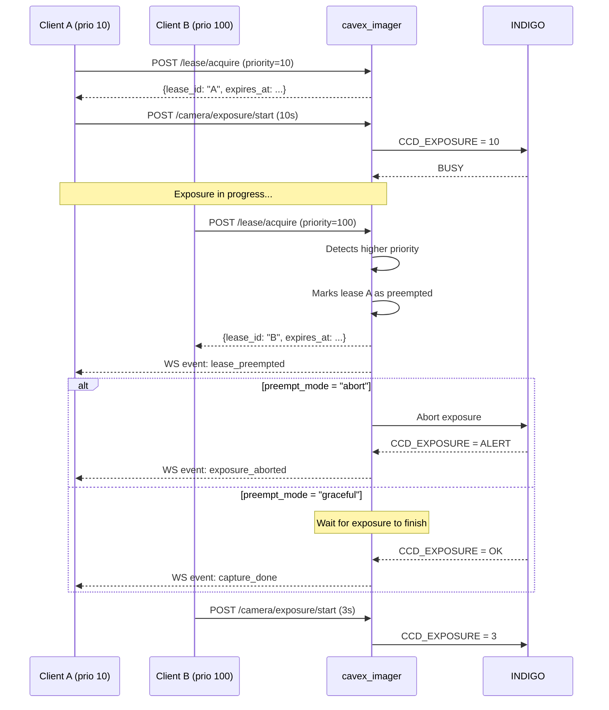
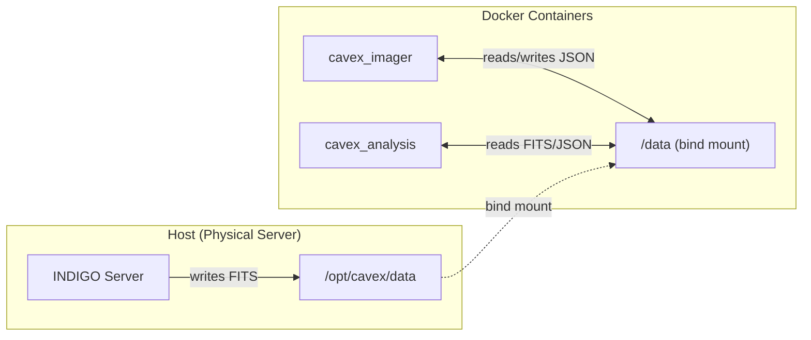

# Technical Specification and Architecture of the `cavex_imager` Service

**Project:** CAVEX_V2 - Calar Alto Extinction Monitor Renovation  
**Version:** 1.2  
**Date:** 2026-02-10  
**Author:** CAVEX_V2 Team

---

## Table of Contents

1. [Introduction](#1-introduction)
2. [Purpose and Scope](#2-purpose-and-scope)
3. [System Context](#3-system-context)
4. [Functional Requirements](#4-functional-requirements)
5. [Non-Functional Requirements](#5-non-functional-requirements)
6. [System Architecture](#6-system-architecture)
7. [Low-Latency INDIGO Adapter](#7-low-latency-indigo-adapter)
8. [Concurrency Management: Lease System](#8-concurrency-management-lease-system)
9. [External API (REST + WebSocket)](#9-external-api-rest--websocket)
10. [Data Schemas](#10-data-schemas)
11. [Storage and Persistence](#11-storage-and-persistence)
12. [Observability and Logging](#12-observability-and-logging)
13. [Error Handling](#13-error-handling)
14. [Implementation Plan](#14-implementation-plan)
15. [Configuration and Deployment](#15-configuration-and-deployment)
16. [Key Technical Decisions](#16-key-technical-decisions)
17. [Appendices](#17-appendices)

---

## 1. Introduction

### 1.1 Project Context

CAVEX_V2 is the renovation project of the atmospheric extinction monitor at Calar Alto Observatory. The current system (NewCAVEX) has limitations in terms of maintainability, scalability, and integration capacity with modern observation systems.

The new system is based on a **microservices architecture** where each component has well-defined responsibilities:

- **`cavex_imager`**: Camera control and image acquisition (this document).
- **`cavex_analysis`**: Scientific processing (photometry, extinction).
- **`cavex_hut`**: Motorized hut control.
- **`cavex_manager`**: Global orchestration and coordination.
- **InfluxDB**: Time series persistence.
- **Grafana**: Visualization and dashboards.

### 1.2 Core Technologies

- **Python 3.11+**: Main language.
- **FastAPI**: Async web framework.
- **INDIGO Astronomy**: Communication bus with astronomical devices.
- **Docker**: Containerization and deployment.
- **CABLE**: "Device Service" pattern for hardware abstraction.

---

## 2. Purpose and Scope

### 2.1 Purpose of `cavex_imager`

`cavex_imager` is the service responsible for:

1. **Controlling the astronomical camera** (QHY600 via INDIGO).
2. **Executing captures** (single and scheduled sequences).
3. **Publishing real-time telemetry** (status, temperature, progress).
4. **Managing concurrent access** through a priority-based lease system.
5. **Coordinating storage** of images in the shared filesystem.

### 2.2 Scope (In-Scope)

✅ Complete camera control via INDIGO:
- Device connection/disconnection.
- Acquisition configuration: ROI, binning, gain, offset, exposure time.
- Cooling system control (cooler).

✅ Image capture:
- Single exposure.
- Periodic sequences with configurable interval.
- Abort/stop exposures in progress.

✅ Storage management:
- Session path configuration (defined by orchestrator).
- Detection of FITS files written by INDIGO.
- Sidecar metadata generation (JSON).

✅ High-frequency telemetry:
- WebSocket at 1-2 Hz with complete status.
- Discrete events (capture_started, capture_done, alarms).

✅ Concurrency control:
- Lease system with priority and TTL.
- Automatic preemption for higher priority clients.

✅ Observability:
- Structured logs (JSON) to stdout and rotated file.
- Diagnostic endpoints and health check.

### 2.3 Out of Scope

❌ Scientific analysis (photometry, astrometry, extinction calculation) → `cavex_analysis`.  
❌ Complete night orchestration → `cavex_manager`.  
❌ Hut control (HUT) → `cavex_hut`.  
❌ Cleanup/retention of old images (will be done externally).  
❌ Graphical user interface (Grafana connects via API/WS).

---

## 3. System Context

### 3.1 General CAVEX_V2 Architecture



### 3.2 Location and Deployment

| Component | Location | Connectivity |
|-----------|----------|--------------|
| **INDIGO Server** | Host (native) | TCP 7624 |
| **cavex_imager** | Docker | Bridge network + host.docker.internal |
| **cavex_analysis** | Docker | Bridge network |
| **Filesystem** | Host `/opt/cavex/data` | Bind mount → `/data` in containers |
| **QHY600 Camera** | USB → Host | Controlled by INDIGO |

### 3.3 Capture Data Flow



---

## 4. Functional Requirements

### 4.1 Camera Control

#### 4.1.1 Connection and Disconnection

**RF-001**: The service must be able to connect and disconnect the INDIGO device `CAVEXCam`.

- Endpoint: `POST /api/v1/camera/connect`
- Endpoint: `POST /api/v1/camera/disconnect`
- Connection status must be reflected in real time in the WebSocket.
- If the device is not available, error `DEVICE_NOT_FOUND` must be reported.

#### 4.1.2 Status Reading

**RF-002**: The service must expose the complete camera status without perceptible latency.

- Endpoint: `GET /api/v1/camera/status`
- Minimum data:
  - Connection status (INDIGO and device).
  - Exposure status (idle/busy/ok/alert).
  - CCD temperature (current and target).
  - Cooler status (on/off, power %).
  - Effective configuration (ROI, binning, gain, offset).
  - Active session path.
  - Current lease status.

#### 4.1.3 Acquisition Configuration

**RF-003**: The service must allow configuring acquisition parameters.

- Endpoint: `POST /api/v1/camera/config`
- Supported parameters:
  - `bin_x`, `bin_y` (horizontal and vertical binning).
  - `roi`: `{x, y, width, height}` (region of interest).
  - `gain`, `offset` (if driver supports it).
  - `cooler_target_c` (CCD target temperature).
  - `cooler_enabled` (enable/disable cooling).

**Validations**:
- ROI must be within sensor limits.
- Binning must be power of 2 (1, 2, 4) or values supported by driver.
- Target temperature within operational range (-30°C to +30°C typically).

#### 4.1.4 Cooling System

**RF-004**: The service must monitor and control the CCD cooler.

- Continuous reading of:
  - `ccd_temp_c`: Current sensor temperature.
  - `cooler_power_pct`: Applied power (0-100%).
  - `cooler_state`: Status (OFF, RAMPING, STABLE, ALARM).
- Control:
  - Enable/disable cooler.
  - Set target temperature.
- Alarms:
  - If temperature deviates >5°C from target for >60s.
  - If cooler is at 100% power for >5 minutes (possible failure).

### 4.2 Image Capture

#### 4.2.1 Single Exposure

**RF-005**: The service must be able to execute a single exposure.

- Endpoint: `POST /api/v1/camera/exposure/start`
- Parameters:
  - `exptime_s`: Exposure time in seconds (0.001 - 3600).
  - `job_id` (optional): Identifier for correlation.
- Response:
  - Immediate (202 Accepted) with `exposure_id`.
  - On completion: WS event `capture_done` with `image_path`.
- Validations:
  - Requires active lease.
  - Cannot start if exposure in progress (409 Conflict).
  - Session path must be configured.

#### 4.2.2 Exposure Abort

**RF-006**: The service must be able to abort an exposure in progress.

- Endpoint: `POST /api/v1/camera/exposure/abort`
- Behavior:
  - If INDIGO driver supports abort, executes immediately.
  - Otherwise, marks as "abort pending" and cancels on completion.
- WS event: `exposure_aborted`.

#### 4.2.3 Scheduled Sequences

**RF-007**: The service must be able to execute exposure sequences.

- Endpoint: `POST /api/v1/camera/sequence/start`
- Parameters:
  - `exptime_s`: Time of each exposure.
  - `count`: Number of exposures (0 = infinite until stop).
  - `period_s`: Interval between exposure starts.
  - `drift_mode`: `"from_start"` or `"from_end"`.
- Endpoint: `POST /api/v1/camera/sequence/stop`
- Behavior:
  - Each image generates an independent `capture_done` event.
  - If `period_s < exptime_s`, warning is reported but executes (back-to-back).

### 4.3 Storage Management

#### 4.3.1 Session Path Configuration

**RF-008**: The orchestrator must be able to define the storage path.

- Endpoint: `POST /api/v1/camera/session`
- Parameters:
  - `storage_path`: Path within container (e.g., `/data/2026-02-10/`).
  - `file_prefix` (optional): Prefix for file names.
  - `naming_pattern` (optional): Naming pattern.
- Validations:
  - Path must exist or be created.
  - Write permissions verified.
  - Sufficient disk space (>10GB recommended).

#### 4.3.2 FITS File Detection

**RF-009**: The service must detect when INDIGO has finished writing a file.

- Mechanism:
  - INDIGO notifies filename via property (driver-specific).
  - Adapter verifies file exists and is readable.
  - Sidecar JSON with metadata is generated.
- Final path:
  - Relative to container: `/data/2026-02-10/img_042.fits`
  - Also accessible to `cavex_analysis` (same bind mount).

#### 4.3.3 Sidecar Metadata (JSON)

**RF-010**: Each image must have an associated JSON file with extended metadata.

- Name: Same basename as FITS (e.g., `img_042.json`).
- Minimum content:
  - `filename`, `timestamp_utc`, `device_name`.
  - `exptime_s`, `gain`, `offset`, `binning`, `roi`.
  - `ccd_temp_c`, `cooler_power_pct`.
  - `lease_owner`, `job_id`, `sequence_id`.
- Atomic write (tmp + rename).

### 4.4 Real-Time Telemetry

#### 4.4.1 Telemetry WebSocket

**RF-011**: The service must expose a WebSocket for data streaming.

- Endpoint: `WS /api/v1/ws/telemetry?rate_hz=1`
- Parameters:
  - `rate_hz`: Frequency of periodic messages (1 or 2 Hz).
- Message types:
  - `telemetry_snapshot`: Complete status (periodic).
  - `capture_event`: Discrete events (started, done, failed, aborted).
  - `lease_event`: Lease changes (acquired, preempted, expired, released).
  - `alarm_event`: Hardware alarms (temperature, cooler, INDIGO disconnected).

#### 4.4.2 Telemetry Content

**RF-012**: Telemetry messages must include critical thermal data.

- Current CCD temperature (`ccd_temp_c`).
- Target temperature (`cooler_setpoint_c`).
- Cooler power (`cooler_power_pct`).
- Cooler status (`cooler_state`).
- Exposure progress (`elapsed_s`, `total_s`, `progress_pct`).

### 4.5 Capabilities and Diagnostics

#### 4.5.1 Device Capabilities

**RF-013**: The service must expose capabilities of the connected device.

- Endpoint: `GET /api/v1/camera/capabilities`
- Information:
  - Camera model, firmware version.
  - Maximum resolution, pixel size.
  - Supported binning range.
  - Gain/offset range.
  - Cooler temperature range.
  - Support for abort, fast readout, etc.

#### 4.5.2 Health Check

**RF-014**: The service must expose a global health endpoint.

- Endpoint: `GET /api/v1/health`
- Response:
  - `status`: `"OK"`, `"WARNING"`, `"ERROR"`.
  - `checks`: Subsystem status (INDIGO, device, storage).
  - `summary`: Human-readable message.
  - `uptime_s`: Time since startup.

#### 4.5.3 Detailed Diagnostics

**RF-015**: The service must expose technical diagnostic information.

- Endpoint: `GET /api/v1/diag/summary`
- Information:
  - Service version and dependencies.
  - INDIGO connection status (connected, last reconnection).
  - Capture statistics (total, failed, last duration).
  - Connected WebSocket clients.
  - Memory and CPU usage (basic).

---

## 5. Non-Functional Requirements

### 5.1 Performance and Latency

**RNF-001**: Status reads (`GET /status`) must respond in <10ms (99th percentile).

- Implementation: Local cache updated by INDIGO events (TCP/XML) in real time.
- Synchronous polling to INDIGO is not allowed in the critical path.

**RNF-002**: Time between "exposure end in INDIGO" and "WS event capture_done" must be <100ms.

- Implementation: Async callbacks, non-blocking sidecar write.

**RNF-003**: WebSocket telemetry must maintain configured cadence (1-2 Hz) with jitter <50ms.

### 5.2 Robustness and Availability

**RNF-004**: The service must automatically reconnect to INDIGO if connection is lost.

- Strategy: Exponential backoff (1s, 2s, 4s, ..., max 30s).
- During disconnection, service reports `status: "WARNING"` in health check.

**RNF-005**: The service must handle camera hotplug (USB disconnected/reconnected).

- INDIGO notifies `delete_property` when device disappears.
- Service invalidates cache and reports `device_connected: false`.
- On reappearance, re-enumerates and restores state.

**RNF-006**: The service must tolerate restarts without loss of critical configuration.

- Session configuration (storage path) is persisted in a state file.
- On restart, attempts to restore last valid session.

### 5.3 Observability

**RNF-007**: The service must emit structured logs (JSON) to stdout and rotated file.

- **Stdout**: For integration with `docker logs` and aggregators (Promtail/Loki).
- **File**: `/data/logs/cavex_imager.log` with automatic rotation.
  - Maximum size: 10 MB per file.
  - Retention: 5 compressed files (.gz).

**RNF-008**: Logs must include `correlation_id` for operation traceability.

- Each HTTP request generates a unique `correlation_id`.
- Propagated to all related logs and events.

**RNF-009**: The service must expose basic metrics for monitoring.

- Endpoint: `GET /api/v1/diag/metrics` (Prometheus-compatible format optional).
- Minimum metrics:
  - `captures_total`, `captures_failed_total`.
  - `last_capture_duration_s`.
  - `indigo_connected` (gauge 0/1).
  - `ws_clients_connected`.
  - `lease_active` (gauge 0/1).

### 5.4 Security

**RNF-010**: The service must support API key authentication.

- Header: `X-API-Key`.
- Configuration: List of valid keys in YAML or environment variable.
- Each key can have an associated default priority for lease.

**RNF-011**: The service must validate all user inputs.

- Type, range, and format validation.
- Path sanitization to avoid directory traversal.

### 5.5 Simplicity and Maintainability

**RNF-012**: The service must avoid unnecessary external dependencies.

- Database not required for capture service.
- Message broker (Redis, RabbitMQ) not required for MVP.

**RNF-013**: Code must follow SOLID principles and Clean Architecture.

- Clear separation between API, Use Cases, Domain, and Adapters.
- Dependency injection to facilitate testing.

---

## 6. System Architecture

### 6.1 Overview

`cavex_imager` follows a **layered** architecture inspired by Clean Architecture, with clear separation of responsibilities:



### 6.2 Main Components

#### 6.2.1 API Layer (FastAPI)

**Responsibilities**:
- Expose REST endpoints and WebSocket.
- Input validation (Pydantic models).
- Authentication (API key).
- Translation of domain exceptions to HTTP codes.
- Generation of `correlation_id`.

**Technologies**:
- FastAPI 0.110+
- Pydantic v2
- Uvicorn (ASGI server)

#### 6.2.2 Use Case Layer

**Responsibilities**:
- Orchestrate business logic.
- Coordinate between domain and adapters.
- Manage transactions and consistency.

**Main Use Cases**:
- `AcquireLease`: Acquire exclusive control with priority.
- `ConfigureSession`: Set storage path.
- `ConnectCamera`: Connect INDIGO device.
- `SetAcquisitionConfig`: Change ROI, binning, gain, etc.
- `StartExposure`: Execute single exposure.
- `StartSequence`: Execute scheduled sequence.
- `GetStatus`: Get snapshot of current state.

#### 6.2.3 Domain Layer

**Responsibilities**:
- Model business concepts (Lease, CameraState, CaptureJob).
- Implement business rules (preemption, validations).
- Be independent of frameworks and external libraries.

**Main Entities**:
- `Lease`: Represents exclusive control with priority and TTL.
- `CameraState`: Complete camera state (snapshot).
- `CaptureJob`: Capture information (id, timestamps, parameters).
- `LeasePolicy`: Preemption and renewal rules.

#### 6.2.4 Ports (Interfaces)

**Responsibilities**:
- Define contracts between use cases and adapters.
- Allow testing with mocks.

**Main Ports**:
- `ICameraPort`: Interface for camera control.
  - `connect()`, `disconnect()`, `get_state()`.
  - `set_config()`, `start_exposure()`, `abort_exposure()`.
- `IFilesystemPort`: Interface for file operations.
  - `validate_path()`, `write_sidecar()`, `check_disk_space()`.
- `ITelemetryPort`: Interface for event publishing.
  - `publish_snapshot()`, `publish_event()`.

#### 6.2.5 Adapters

**Responsibilities**:
- Implement ports with concrete technologies.
- Isolate infrastructure details.

**Main Adapters**:
- `IndigoAdapter`: Implements `ICameraPort` using TCP/XML event-driven.
- `FilesystemAdapter`: Implements `IFilesystemPort` with POSIX operations.
- `TelemetryHub`: Implements `ITelemetryPort` with WebSocket broadcast.

### 6.3 Internal Data Flow

#### 6.3.1 Command Flow (Write)



#### 6.3.2 Event Flow (Read)



---

## 7. Low-Latency INDIGO Adapter

### 7.1 Motivation

INDIGO is an **asynchronous callback-based bus**. To minimize latency:

1. **No polling**: Adapter must react to events, not constantly query.
2. **Local cache**: Status reads must be O(1) without RTT to INDIGO.
3. **Separate threads**: INDIGO callbacks must not block write operations.

### 7.2 Adapter Architecture



### 7.3 Adapter Components

#### 7.3.1 INDIGO Event Reception (TCP/XML)

The adapter connects to the INDIGO server via a **persistent TCP socket** (default `:7624`) and processes the event-oriented XML protocol:

- `def*Vector`: Initial property definition (arrives on connect and when new devices/properties appear).
- `set*Vector`: Value and state updates (arrives when something changes: temperature, exposure, connection, etc.).
- `delProperty` / `deleteProperty` (depending on implementation): Property deletion notification (e.g., hotplug or device disappeared).

**Critical rule**: adapter operates in **event-driven** mode.  
Implementing `GET /status` with synchronous queries to INDIGO is not allowed; `GET /status` must read only from the **local cache**.

**Implementation details**:
- A dedicated `asyncio.Task` maintains connection and retries with backoff if it drops.
- A streaming XML parser updates the cache (`CameraStateCache` structure) and publishes relevant events in `asyncio.Queue`.
- Commands to INDIGO (`newNumberVector`, `newSwitchVector`, `newTextVector`) are serialized in a single "writer task" to maintain order and avoid race conditions.

#### 7.3.2 State Cache

In-memory structure (Python) with lock for thread-safety:

```python
@dataclass
class CameraStateCache:
    device_name: str
    connected: bool
    indigo_connected: bool

    # Mapped INDIGO properties
    connection_state: str  # CONNECTED/DISCONNECTED
    exposure_state: str    # IDLE/BUSY/OK/ALERT
    exposure_value: float
    exposure_target: float

    ccd_temp: float
    cooler_target: float
    cooler_power: float
    cooler_on: bool

    bin_x: int
    bin_y: int
    roi: tuple[int, int, int, int]
    gain: Optional[int]
    offset: Optional[int]

    last_image_path: Optional[str]
    last_update: datetime
```

#### 7.3.3 Command Queue

Thread-safe queue to serialize commands to INDIGO:

```python
class CommandQueue:
    def __init__(self):
        self._queue = queue.Queue()
        self._worker = threading.Thread(target=self._process_commands)
        self._worker.start()

    def enqueue(self, cmd: Command):
        self._queue.put(cmd)

    def _process_commands(self):
        while True:
            cmd = self._queue.get()
            self._execute_indigo_command(cmd)
```

#### 7.3.4 Event Queue

Asyncio queue to communicate events to the rest of the system:

```python
class EventQueue:
    def __init__(self):
        self._queue = asyncio.Queue()

    async def get(self) -> Event:
        return await self._queue.get()

    def put_nowait(self, event: Event):
        self._queue.put_nowait(event)
```

### 7.4 INDIGO Property Mapping

According to [INDIGO CLIENT_DEVELOPMENT_BASICS](https://github.com/indigo-astronomy/indigo/blob/master/indigo_docs/CLIENT_DEVELOPMENT_BASICS.md), standard CCD properties are:

| INDIGO Property     | Type   | Description                          | Cache Mapping                        |
| -------------------- | ------ | ------------------------------------ | ------------------------------------- |
| `CONNECTION`         | Switch | CONNECTED/DISCONNECTED               | `connected`                           |
| `INFO`               | Text   | Device info, interface               | `device_name`, validation             |
| `CCD_TEMPERATURE`    | Number | Current temp (value) and target      | `ccd_temp`, `cooler_target`           |
| `CCD_COOLER`         | Switch | ON/OFF                               | `cooler_on`                           |
| `CCD_COOLER_POWER`   | Number | Power %                              | `cooler_power`                        |
| `CCD_BIN`            | Number | HORIZONTAL, VERTICAL                 | `bin_x`, `bin_y`                      |
| `CCD_FRAME`          | Number | LEFT, TOP, WIDTH, HEIGHT             | `roi`                                 |
| `CCD_GAIN`           | Number | Gain value                           | `gain`                                |
| `CCD_OFFSET`         | Number | Offset value                         | `offset`                              |
| `CCD_EXPOSURE`       | Number | Exposure time                        | `exposure_target`, `exposure_value`   |
| `CCD_IMAGE`          | Blob   | Image data (in local mode: filename) | `last_image_path`                     |
| `CCD_ABORT_EXPOSURE` | Switch | Abort current exposure               | `exposure_abort`                      |
| `CCD_FRAME_TYPE`     | Switch | Select LIGHT, BIAS, DARK, FLAT       | `frame_type`                          |
| `CCD_UPLOAD_MODE`    | Switch | Select CLIENT, LOCAL, BOTH           | `upload_mode`                         |
| `CCD_LOCAL_MODE`     | Text   | Select DIR and PREFIX                | `local_mode_dir`, `local_mode_prefix` |

### 7.5 Local Save Configuration

To avoid BLOB download over network, INDIGO must be configured in "local save" mode. This is typically done with driver-specific properties (varies by QHY driver).

**Strategy**:
1. In `define_property`, search for properties related to "local mode" (CCD_UPLOAD_MODE.LOCAL), "save path" (CCD_LOCAL_MODE.DIR), and "image prefix" (CCD_LOCAL_MODE.PREFIX).
2. Configure base path (translated from container to host).
3. Listen to property that notifies generated filename.

### 7.6 Reconnection Management



**Backoff Strategy**:
- Attempt 1: immediate
- Attempt 2: 1s
- Attempt 3: 2s
- Attempt 4+: 5s (maximum)

During disconnection, service reports `health: "WARNING"` and maintains last known state in cache.

---

## 8. Concurrency Management: Lease System

### 8.1 Motivation

Multiple clients may want to control the camera simultaneously:
- **Orchestrator** (`cavex_manager`): Automatic nightly operation.
- **Engineering**: Tests, calibration, diagnostics.
- **Monitoring**: Status reads (do not require lease).

The lease system guarantees:
- **Exclusivity**: Only one client can execute write commands at a time.
- **Priority**: Critical clients (orchestrator) can preempt others.
- **Recovery**: Automatic TTL to avoid permanent locks.

### 8.2 Lease Model

```python
@dataclass
class Lease:
    lease_id: str
    owner: str
    priority: int  # Higher = more priority
    acquired_at: datetime
    expires_at: datetime
    ttl_seconds: int
    preempted: bool = False
```

### 8.3 Business Rules

1. **Reads without lease**: `GET /status`, `GET /capabilities` do not require lease.
2. **Writes with lease**: All control commands require active lease.
3. **Priority preemption**:
   - If an `acquire_lease` arrives with higher priority, current lease is marked as `preempted`.
   - New client gets control immediately.
   - Preempted client receives WS event `lease_preempted`.
4. **TTL and renewal**:
   - Each lease has a TTL (typically 60-300s).
   - Client must renew periodically with `POST /lease/renew`.
   - If expires, automatically released.

### 8.4 Preemption Policy

Configurable in YAML:

```yaml
lease:
  preempt_mode: "graceful"  # or "abort"
  default_ttl_seconds: 120
  max_ttl_seconds: 600
```

**Modes**:
- `graceful`: Does not abort exposure in progress, but prevents new commands from preempted lease.
- `abort`: Aborts exposure in progress on preemption (if driver supports abort).

### 8.5 Lease State Diagram



### 8.6 Preemption Flow Example



---

## 9. External API (REST + WebSocket)

### 9.1 General Conventions

- **Base URL**: `/api/v1`
- **Format**: JSON (request and response)
- **Authentication**: Header `X-API-Key` (optional but recommended)
- **Errors**: Consistent format (see section 13)
- **Versioning**: In URL (`/v1`), allows future evolution

### 9.2 Authentication

If enabled (YAML configuration):

```yaml
auth:
  enabled: true
  keys:
    - key: "cavex_manager_key_12345"
      owner: "cavex_manager"
      priority: 100
    - key: "engineering_key_67890"
      owner: "engineering"
      priority: 50
```

All requests must include:
```
X-API-Key: cavex_manager_key_12345
```

### 9.3 REST Endpoints

#### 9.3.1 Health and Diagnostics

##### `GET /api/v1/health`

**Description**: Global service health check.

**Response 200**:
```json
{
  "status": "OK",
  "uptime_s": 86400,
  "checks": {
    "indigo_server": "CONNECTED",
    "camera_device": "READY",
    "storage_writable": "YES",
    "last_exposure": "SUCCESS",
    "active_alerts": 0
  },
  "summary": "Camera CAVEXCam is idle at -10.2°C. Storage has 450GB free."
}
```

**`status` values**:
- `OK`: Everything operational.
- `WARNING`: Functional but with minor issues (e.g., INDIGO disconnected but reconnecting).
- `ERROR`: Not operational (e.g., device not found, storage not writable).

##### `GET /api/v1/diag/summary`

**Description**: Detailed technical information for diagnostics.

**Response 200**:
```json
{
  "service": {
    "name": "cavex_imager",
    "version": "1.0.0",
    "uptime_s": 86400,
    "started_at": "2026-02-10T00:00:00Z"
  },
  "indigo": {
    "connected": true,
    "server_host": "172.17.0.1",
    "server_port": 7624,
    "last_reconnect": null,
    "reconnect_attempts": 0
  },
  "device": {
    "name": "CAVEXCam",
    "model": "QHY600",
    "connected": true,
    "capabilities_detected": true
  },
  "statistics": {
    "captures_total": 1523,
    "captures_failed": 3,
    "last_capture_duration_s": 3.12,
    "avg_capture_duration_s": 3.05
  },
  "websocket": {
    "clients_connected": 2
  },
  "storage": {
    "session_path": "/data/2026-02-10/",
    "disk_free_gb": 450.2
  }
}
```

##### `GET /api/v1/diag/last_errors`

**Description**: Last registered errors (useful for debugging without accessing logs).

**Response 200**:
```json
{
  "errors": [
    {
      "timestamp": "2026-02-10T22:15:00Z",
      "code": "INDIGO_TIMEOUT",
      "message": "No response from INDIGO server after 5s",
      "context": {
        "property": "CCD_EXPOSURE",
        "device": "CAVEXCam"
      },
      "correlation_id": "a1b2c3d4"
    }
  ]
}
```

#### 9.3.2 Status and Capabilities

##### `GET /api/v1/camera/status`

**Description**: Complete camera status (snapshot from cache).

**Response 200**: See section 10.1 (CameraStatus).

##### `GET /api/v1/camera/capabilities`

**Description**: Capabilities of the connected device.

**Response 200**:
```json
{
  "device": {
    "name": "CAVEXCam",
    "model": "QHY600",
    "interface": "INDIGO_INTERFACE_CCD"
  },
  "sensor": {
    "width_px": 9600,
    "height_px": 6422,
    "pixel_size_um": 3.76,
    "bit_depth": 16
  },
  "binning": {
    "supported": [1, 2, 4],
    "max_x": 4,
    "max_y": 4
  },
  "gain": {
    "supported": true,
    "min": 0,
    "max": 56,
    "step": 1
  },
  "offset": {
    "supported": true,
    "min": 0,
    "max": 100,
    "step": 1
  },
  "cooler": {
    "supported": true,
    "min_temp_c": -30,
    "max_temp_c": 30
  },
  "features": {
    "can_abort": true,
    "has_shutter": false,
    "has_guide_port": false
  }
}
```

#### 9.3.3 Session Configuration

##### `POST /api/v1/camera/session`

**Description**: Configure storage path for current session.

**Request**:
```json
{
  "storage_path": "/data/2026-02-10/",
  "file_prefix": "cavex",
  "naming_pattern": "{prefix}_{seq:04d}.fits"
}
```

**Response 200**:
```json
{
  "session_id": "session_20260210_220000",
  "storage_path": "/data/2026-02-10/",
  "disk_free_gb": 450.2,
  "configured_at": "2026-02-10T22:00:00Z"
}
```

**Errors**:
- `400`: Invalid or inaccessible path.
- `403`: No active lease.
- `507`: Insufficient disk space (<10GB).

#### 9.3.4 Lease Management

##### `POST /api/v1/lease/acquire`

**Description**: Acquire exclusive camera control.

**Request**:
```json
{
  "owner": "cavex_manager",
  "priority": 100,
  "ttl_seconds": 120
}
```

**Response 200**:
```json
{
  "lease_id": "lease_a1b2c3d4",
  "owner": "cavex_manager",
  "priority": 100,
  "acquired_at": "2026-02-10T22:00:00Z",
  "expires_at": "2026-02-10T22:02:00Z"
}
```

**Response 409** (if lease with higher priority exists):
```json
{
  "error": {
    "code": "LEASE_CONFLICT",
    "message": "Cannot acquire lease: existing lease has higher priority",
    "context": {
      "current_owner": "emergency_client",
      "current_priority": 200
    }
  }
}
```

##### `POST /api/v1/lease/renew`

**Description**: Renew existing lease.

**Request**:
```json
{
  "lease_id": "lease_a1b2c3d4",
  "ttl_seconds": 120
}
```

**Response 200**:
```json
{
  "lease_id": "lease_a1b2c3d4",
  "expires_at": "2026-02-10T22:04:00Z"
}
```

##### `POST /api/v1/lease/release`

**Description**: Voluntarily release lease.

**Request**:
```json
{
  "lease_id": "lease_a1b2c3d4"
}
```

**Response 200**:
```json
{
  "released": true,
  "released_at": "2026-02-10T22:03:00Z"
}
```

##### `GET /api/v1/lease/status`

**Description**: Query current lease status.

**Response 200** (with active lease):
```json
{
  "active": true,
  "lease_id": "lease_a1b2c3d4",
  "owner": "cavex_manager",
  "priority": 100,
  "acquired_at": "2026-02-10T22:00:00Z",
  "expires_at": "2026-02-10T22:02:00Z",
  "expires_in_s": 45
}
```

**Response 200** (no lease):
```json
{
  "active": false
}
```

#### 9.3.5 Camera Control

##### `POST /api/v1/camera/connect`

**Description**: Connect INDIGO device.

**Request**: `{}`

**Response 200**:
```json
{
  "device": "CAVEXCam",
  "connected": true,
  "connected_at": "2026-02-10T22:00:00Z"
}
```

**Errors**:
- `403`: No active lease.
- `404`: Device not found.
- `503`: INDIGO server unavailable.

##### `POST /api/v1/camera/disconnect`

**Description**: Disconnect INDIGO device.

**Request**: `{}`

**Response 200**:
```json
{
  "device": "CAVEXCam",
  "connected": false,
  "disconnected_at": "2026-02-10T22:05:00Z"
}
```

##### `POST /api/v1/camera/config`

**Description**: Configure acquisition parameters.

**Request**:
```json
{
  "binning": {
    "x": 2,
    "y": 2
  },
  "roi": {
    "x": 0,
    "y": 0,
    "width": 4800,
    "height": 3211
  },
  "gain": 26,
  "offset": 10,
  "cooler": {
    "enabled": true,
    "target_c": -10.0
  }
}
```

**Response 200**:
```json
{
  "applied": true,
  "config": {
    "binning": [2, 2],
    "roi": [0, 0, 4800, 3211],
    "gain": 26,
    "offset": 10,
    "cooler_target_c": -10.0
  },
  "applied_at": "2026-02-10T22:00:00Z"
}
```

**Errors**:
- `400`: Parameters out of range.
- `403`: No active lease.
- `409`: Cannot change config during exposure.

#### 9.3.6 Capture

##### `POST /api/v1/camera/exposure/start`

**Description**: Start single exposure.

**Request**:
```json
{
  "exptime_s": 3.0,
  "job_id": "night_001"
}
```

**Response 202**:
```json
{
  "exposure_id": "exp_a1b2c3d4",
  "exptime_s": 3.0,
  "started_at": "2026-02-10T22:00:00Z",
  "estimated_done_at": "2026-02-10T22:00:03Z"
}
```

**Errors**:
- `403`: No active lease.
- `409`: Exposure already in progress.
- `400`: Invalid exposure time.

##### `POST /api/v1/camera/exposure/abort`

**Description**: Abort exposure in progress.

**Request**: `{}`

**Response 200**:
```json
{
  "aborted": true,
  "aborted_at": "2026-02-10T22:00:01.5Z"
}
```

**Errors**:
- `403`: No active lease.
- `409`: No exposure in progress.

##### `POST /api/v1/camera/sequence/start`

**Description**: Start exposure sequence.

**Request**:
```json
{
  "exptime_s": 3.0,
  "count": 10,
  "period_s": 5.0,
  "drift_mode": "from_start",
  "job_id": "sequence_001"
}
```

**Parameters**:
- `count`: Number of exposures (0 = infinite until stop).
- `period_s`: Interval between exposure starts.
- `drift_mode`:
  - `"from_start"`: Period measured from start of each exposure.
  - `"from_end"`: Period measured from end of each exposure.

**Response 202**:
```json
{
  "sequence_id": "seq_a1b2c3d4",
  "exptime_s": 3.0,
  "count": 10,
  "period_s": 5.0,
  "started_at": "2026-02-10T22:00:00Z"
}
```

##### `POST /api/v1/camera/sequence/stop`

**Description**: Stop sequence in progress.

**Request**:
```json
{
  "sequence_id": "seq_a1b2c3d4"
}
```

**Response 200**:
```json
{
  "stopped": true,
  "stopped_at": "2026-02-10T22:01:00Z",
  "completed_count": 12
}
```

### 9.4 WebSocket

#### 9.4.1 Connection

**Endpoint**: `WS /api/v1/ws/telemetry?rate_hz=1`

**Parameters**:
- `rate_hz`: Frequency of periodic messages (1 or 2).
- `X-API-Key`: Authentication header (if enabled).

#### 9.4.2 Message Types

All messages have the structure:
```json
{
  "type": "telemetry_snapshot | capture_event | lease_event | alarm_event",
  "timestamp": "2026-02-10T22:00:00.123Z",
  "data": { ... }
}
```

##### Message: `telemetry_snapshot`

Sent periodically according to `rate_hz`.

```json
{
  "type": "telemetry_snapshot",
  "timestamp": "2026-02-10T22:00:00.123Z",
  "data": {
    "device": {
      "name": "CAVEXCam",
      "connected": true
    },
    "status": {
      "state": "BUSY",
      "exposure": {
        "is_exposing": true,
        "elapsed_s": 1.5,
        "total_s": 3.0,
        "progress_pct": 50.0
      },
      "thermal": {
        "ccd_temp_c": -10.2,
        "target_temp_c": -10.0,
        "cooler_on": true,
        "cooler_power_pct": 45.5,
        "cooler_state": "STABLE"
      }
    },
    "config": {
      "binning": [1, 1],
      "roi": [0, 0, 9600, 6422],
      "gain": 26,
      "offset": 10
    },
    "lease": {
      "active": true,
      "owner": "cavex_manager",
      "priority": 100,
      "expires_in_s": 45
    }
  }
}
```

##### Message: `capture_event`

Sent at start, end, or failure of a capture.

```json
{
  "type": "capture_event",
  "timestamp": "2026-02-10T22:00:03.123Z",
  "data": {
    "event": "capture_done",
    "exposure_id": "exp_a1b2c3d4",
    "job_id": "night_001",
    "exptime_s": 3.0,
    "image_path": "/data/2026-02-10/cavex_0042.fits",
    "ccd_temp_c": -10.2
  }
}
```

**`event` values**:
- `capture_started`
- `capture_done`
- `capture_failed`
- `capture_aborted`

##### Message: `lease_event`

Sent when lease status changes.

```json
{
  "type": "lease_event",
  "timestamp": "2026-02-10T22:00:00.123Z",
  "data": {
    "event": "lease_preempted",
    "old_owner": "engineering",
    "new_owner": "cavex_manager",
    "new_priority": 100
  }
}
```

**`event` values**:
- `lease_acquired`
- `lease_renewed`
- `lease_preempted`
- `lease_expired`
- `lease_released`

##### Message: `alarm_event`

Sent when an abnormal condition is detected.

```json
{
  "type": "alarm_event",
  "timestamp": "2026-02-10T22:00:00.123Z",
  "data": {
    "severity": "WARNING",
    "code": "COOLER_HIGH_POWER",
    "message": "Cooler at 100% power for >5 minutes",
    "context": {
      "ccd_temp_c": -8.5,
      "target_temp_c": -10.0,
      "cooler_power_pct": 100.0
    }
  }
}
```

**`severity` values**:
- `INFO`
- `WARNING`
- `ERROR`
- `CRITICAL`

---

## 10. Data Schemas

### 10.1 CameraStatus (Complete)

```json
{
  "timestamp": "2026-02-10T22:05:00.123Z",
  "device": {
    "name": "CAVEXCam",
    "model": "QHY600",
    "interface": "INDIGO_INTERFACE_CCD",
    "connected": true
  },
  "indigo": {
    "connected": true,
    "server": "172.17.0.1:7624"
  },
  "status": {
    "state": "IDLE",
    "exposure": {
      "is_exposing": false,
      "elapsed_s": 0.0,
      "total_s": 0.0,
      "progress_pct": 0.0
    },
    "thermal": {
      "ccd_temp_c": -10.2,
      "target_temp_c": -10.0,
      "cooler_on": true,
      "cooler_power_pct": 45.5,
      "cooler_state": "STABLE"
    }
  },
  "config": {
    "binning": [1, 1],
    "roi": [0, 0, 9600, 6422],
    "gain": 26,
    "offset": 10
  },
  "storage": {
    "session_path": "/data/2026-02-10/",
    "last_file": "cavex_0042.fits",
    "disk_free_gb": 450.2
  },
  "lease": {
    "active": true,
    "lease_id": "lease_a1b2c3d4",
    "owner": "cavex_manager",
    "priority": 100,
    "acquired_at": "2026-02-10T22:00:00Z",
    "expires_at": "2026-02-10T22:02:00Z",
    "expires_in_s": 45
  }
}
```

### 10.2 Sidecar JSON (Image Metadata)

File: `cavex_0042.json` (same basename as FITS).

```json
{
  "filename": "cavex_0042.fits",
  "timestamp_utc": "2026-02-10T22:00:03.123Z",
  "device": {
    "name": "CAVEXCam",
    "model": "QHY600"
  },
  "acquisition": {
    "exptime_s": 3.0,
    "gain": 26,
    "offset": 10,
    "binning": [1, 1],
    "roi": [0, 0, 9600, 6422]
  },
  "thermal": {
    "ccd_temp_c": -10.2,
    "cooler_power_pct": 45.5
  },
  "context": {
    "lease_owner": "cavex_manager",
    "job_id": "night_001",
    "sequence_id": null,
    "exposure_id": "exp_a1b2c3d4"
  },
  "cavex": {
    "service_version": "1.0.0",
    "indigo_version": "2.0.300"
  }
}
```

---

## 11. Storage and Persistence

### 11.1 Storage Architecture



### 11.2 Directory Structure

```
/opt/cavex/data/                    (Host)
├── 2026-02-10/                     (Session per night)
│   ├── cavex_0001.fits
│   ├── cavex_0001.json
│   ├── cavex_0002.fits
│   ├── cavex_0002.json
│   └── ...
├── 2026-02-11/
│   └── ...
└── logs/                           (Persistent logs)
    ├── cavex_imager.log
    ├── cavex_imager.log.1.gz
    └── ...
```

### 11.3 Path Mapping

| Context | Path |
|---------|------|
| Host (INDIGO) | `/opt/cavex/data/2026-02-10/` |
| Container (cavex_imager) | `/data/2026-02-10/` |
| Container (cavex_analysis) | `/data/2026-02-10/` |

**Configuration in `docker-compose.yml`**:
```yaml
services:
  cavex_imager:
    volumes:
      - /opt/cavex/data:/data
```

### 11.4 File Naming

**Default pattern**: `{prefix}_{seq:04d}.fits`

Example: `cavex_0042.fits`

**Configurable per session**:
```json
{
  "file_prefix": "cavex",
  "naming_pattern": "{prefix}_{date}_{seq:04d}.fits"
}
```

Result: `cavex_20260210_0042.fits`

### 11.5 Atomic Write

To prevent `cavex_analysis` from reading incomplete files:

1. INDIGO writes: `/data/2026-02-10/cavex_0042.fits.tmp`
2. `cavex_imager` detects completion.
3. `cavex_imager` writes: `/data/2026-02-10/cavex_0042.json`
4. INDIGO (or `cavex_imager`) renames: `cavex_0042.fits.tmp` → `cavex_0042.fits`

**Note**: Rename responsibility depends on how INDIGO driver works. If INDIGO already does atomic write, `cavex_imager` only writes JSON.

### 11.6 Storage Validations

When configuring session (`POST /camera/session`):

1. **Existence**: Verify path exists or create it.
2. **Permissions**: Verify write with test file.
3. **Space**: Verify free space >10GB (configurable).
4. **Mapping**: Translate container path to host path for INDIGO.

---

## 12. Observability and Logging

### 12.1 Logging Strategy

The service implements **dual logging**:

1. **Stdout (JSON)**: For `docker logs` and aggregators (Promtail/Loki).
2. **Rotated file**: For historical audit and post-mortem diagnostics.

### 12.2 Logger Configuration

**Library**: `structlog` (recommended) or standard `logging` with `RotatingFileHandler`.

**Handlers**:

1. **StreamHandler (Stdout)**:
   - Format: Structured JSON.
   - Level: `INFO` (configurable to `DEBUG` via env var `LOG_LEVEL`).

2. **RotatingFileHandler**:
   - Path: `/data/logs/cavex_imager.log`
   - MaxBytes: `10485760` (10MB)
   - BackupCount: `5`
   - Compression: `.gz` for rotated files.

### 12.3 Log Structure

Each entry must include:

```json
{
  "timestamp": "2026-02-10T22:15:00.456Z",
  "level": "INFO",
  "event": "exposure_started",
  "service": "cavex_imager",
  "correlation_id": "a1b2c3d4",
  "lease_owner": "cavex_manager",
  "params": {
    "exptime": 3.0,
    "job_id": "night_001"
  },
  "context": {
    "device": "CAVEXCam",
    "session_path": "/data/2026-02-10/"
  }
}
```

### 12.4 Events to Log

**Service lifecycle**:
- `service_started`, `service_stopped`
- `config_loaded`, `config_error`

**INDIGO connection**:
- `indigo_connecting`, `indigo_connected`, `indigo_disconnected`
- `indigo_reconnect_attempt` (with attempt number)
- `indigo_reconnect_failed`, `indigo_reconnect_success`

**Device**:
- `device_detected`, `device_connected`, `device_disconnected`
- `device_not_found`, `device_hotplug_removed`

**Lease**:
- `lease_acquired`, `lease_renewed`, `lease_released`
- `lease_preempted`, `lease_expired`
- `lease_conflict` (failed attempt)

**Configuration**:
- `session_configured`, `config_changed`
- `storage_path_validated`, `storage_path_error`

**Capture**:
- `exposure_started`, `exposure_progress`, `exposure_done`
- `exposure_aborted`, `exposure_failed`
- `sequence_started`, `sequence_stopped`, `sequence_completed`
- `image_detected`, `sidecar_written`

**Errors**:
- `error` (with `code`, `message`, `context`, `correlation_id`)
- `alarm` (with `severity`, `code`, `message`)

### 12.5 Docker Logging Configuration

To prevent Docker from filling disk with its own logs:

```yaml
services:
  cavex_imager:
    logging:
      driver: "json-file"
      options:
        max-size: "10m"
        max-file: "3"
```

### 12.6 Log Query

**Real time**:
```bash
docker logs -f cavex_imager
```

**Filtered by event**:
```bash
docker logs cavex_imager | jq 'select(.event == "exposure_started")'
```

**Historical logs**:
```bash
ls -lh /opt/cavex/data/logs/
zcat /opt/cavex/data/logs/cavex_imager.log.1.gz | jq
```

---

## 13. Error Handling

### 13.1 Error Taxonomy

| Code | HTTP | Description | Action |
|------|------|-------------|--------|
| `VALIDATION_ERROR` | 400 | Invalid parameters | Fix request |
| `UNAUTHORIZED` | 401 | Invalid API key | Verify credentials |
| `FORBIDDEN` | 403 | No active lease | Acquire lease |
| `DEVICE_NOT_FOUND` | 404 | Device not detected | Verify USB/INDIGO connection |
| `CONFLICT` | 409 | Incompatible operation | Wait or abort current operation |
| `INDIGO_UNAVAILABLE` | 503 | INDIGO server not responding | Verify INDIGO, wait for reconnection |
| `INDIGO_TIMEOUT` | 504 | Timeout waiting for response | Retry or verify INDIGO |
| `IO_ERROR` | 500 | Filesystem error | Verify permissions/space |
| `INTERNAL_ERROR` | 500 | Unexpected error | Review logs |

### 13.2 Error Format

All error responses follow this format:

```json
{
  "error": {
    "code": "CONFLICT",
    "message": "Cannot start exposure: another exposure is in progress",
    "context": {
      "current_exposure_id": "exp_xyz",
      "elapsed_s": 1.5,
      "total_s": 3.0
    },
    "correlation_id": "a1b2c3d4",
    "timestamp": "2026-02-10T22:00:00.123Z"
  }
}
```

### 13.3 Recovery Strategies

**INDIGO disconnected**:
- Service reports `health: "WARNING"`.
- Automatic reconnection with exponential backoff.
- Operations in progress fail with `INDIGO_UNAVAILABLE`.
- On reconnect, re-enumerates and restores state.

**Device disconnected (hotplug)**:
- Service reports `device_connected: false`.
- Operations fail with `DEVICE_NOT_FOUND`.
- On reconnect, automatically detected (callback `define_property`).

**Lease expired**:
- Operations fail with `FORBIDDEN`.
- Client must renew or re-acquire lease.

**Insufficient disk space**:
- Session configuration fails with `IO_ERROR`.
- Captures fail with `IO_ERROR`.
- `DISK_SPACE_LOW` alarm sent via WS.

---

## 14. Implementation Plan

### 14.1 Development Phases

#### Phase 1: Skeleton and INDIGO Connection (Week 1-2)

**Objectives**:
- Basic FastAPI service with health check.
- INDIGO client via TCP socket (XML protocol), event-oriented (def/set/delete).
- Connection to INDIGO server and detection of `CAVEXCam`.
- Basic property cache.
- `GET /status` endpoint with data from cache.

**Deliverables**:
- Service starts and connects to INDIGO.
- `GET /health` responds with connection status.
- `GET /status` shows temperature and connection status.

**Acceptance Criteria**:
- Service automatically reconnects if INDIGO restarts.
- Logs show connection/disconnection events.

#### Phase 2: Lease and Basic Control (Week 3)

**Objectives**:
- Implement `LeaseManager` with priority and TTL.
- Lease endpoints (`acquire`, `renew`, `release`, `status`).
- Control endpoints (`connect`, `disconnect`, `config`).
- Command queue to serialize operations to INDIGO.

**Deliverables**:
- Functional lease system with preemption.
- Can connect/disconnect camera.
- Can change binning, ROI, gain, offset.

**Acceptance Criteria**:
- Client with higher priority can preempt another.
- Configuration changes are reflected in `GET /status`.
- Logs show lease events.

#### Phase 3: Capture and Storage (Week 4-5)

**Objectives**:
- Session configuration (`POST /camera/session`).
- Single exposure (`POST /camera/exposure/start`).
- Detection of FITS file written by INDIGO.
- Sidecar JSON write.
- Capture WS events.

**Deliverables**:
- Can execute an exposure and get FITS path.
- Sidecar JSON is generated correctly.
- WS event `capture_done` is sent on completion.

**Acceptance Criteria**:
- FITS file exists and is readable.
- Sidecar JSON contains all required metadata.
- Time between exposure end and WS event is <100ms.

#### Phase 4: Telemetry and WebSocket (Week 6)

**Objectives**:
- Telemetry WebSocket at 1-2 Hz.
- Messages `telemetry_snapshot`, `capture_event`, `lease_event`.
- Inclusion of thermal data (temperature, cooler).

**Deliverables**:
- Functional WebSocket with configurable cadence.
- Clients receive periodic snapshots and discrete events.

**Acceptance Criteria**:
- Cadence maintained with jitter <50ms.
- Thermal data updates in real time.
- Multiple clients can connect simultaneously.

#### Phase 5: Sequences and Robustness (Week 7-8)

**Objectives**:
- Scheduled sequences (`POST /camera/sequence/start`).
- Exposure and sequence abort.
- Hotplug handling (device disconnected/reconnected).
- Alarms (temperature, cooler, disk).

**Deliverables**:
- Sequences work with configurable interval.
- Abort works correctly.
- Service handles hotplug without crash.

**Acceptance Criteria**:
- Sequence of 10 exposures completes without errors.
- If camera disconnects, service reports error and recovers on reconnect.
- Alarms sent via WS when appropriate.

#### Phase 6: Observability and Hardening (Week 9-10)

**Objectives**:
- Complete logging (stdout + rotated file).
- Diagnostic endpoints (`/diag/summary`, `/diag/last_errors`).
- Basic metrics.
- Load testing (multiple clients, long sequences).
- API documentation (OpenAPI/Swagger).

**Deliverables**:
- Structured logs in JSON.
- Log rotation functional.
- API documentation automatically generated.

**Acceptance Criteria**:
- Logs are readable and useful for debugging.
- Service supports 5 simultaneous WS clients without degradation.
- API documentation is complete and updated.

### 14.2 Milestones and Deliverables

| Milestone | Week | Deliverable |
|-----------|------|-------------|
| M1: INDIGO Connection | 2 | Service connects and reads basic status |
| M2: Lease and Control | 3 | Functional lease system |
| M3: Single Capture | 5 | Single exposure with FITS + JSON |
| M4: Telemetry | 6 | WebSocket with real-time data |
| M5: Sequences | 8 | Scheduled sequences work |
| M6: Production | 10 | Service ready for 24/7 deployment |

---

## 15. Configuration and Deployment

### 15.1 Configuration File (YAML)

**Location**: `/data/config/cavex_imager.yaml` (bind mount)

```yaml
service:
  name: cavex_imager
  version: 1.0.0
  log_level: INFO  # DEBUG, INFO, WARNING, ERROR

indigo:
  host: 172.17.0.1  # Host IP from container
  port: 7624
  device_name: CAVEXCam
  reconnect:
    enabled: true
    max_attempts: 0  # 0 = infinite
    backoff_max_s: 30

auth:
  enabled: true
  keys:
    - key: "cavex_manager_key_12345"
      owner: "cavex_manager"
      priority: 100
    - key: "engineering_key_67890"
      owner: "engineering"
      priority: 50

lease:
  preempt_mode: graceful  # graceful | abort
  default_ttl_seconds: 120
  max_ttl_seconds: 600

storage:
  host_base_path: /opt/cavex/data
  container_base_path: /data
  min_free_gb: 10
  default_file_prefix: cavex
  default_naming_pattern: "{prefix}_{seq:04d}.fits"

telemetry:
  default_rate_hz: 1
  max_ws_clients: 10

logging:
  stdout:
    enabled: true
    format: json
  file:
    enabled: true
    path: /data/logs/cavex_imager.log
    max_bytes: 10485760  # 10MB
    backup_count: 5
    compress: true
```

### 15.2 Environment Variables

Can override YAML values:

```bash
LOG_LEVEL=DEBUG
INDIGO_HOST=172.17.0.1
INDIGO_PORT=7624
AUTH_ENABLED=true
```

### 15.3 Docker Compose

```yaml
version: '3.8'

services:
  cavex_imager:
    image: caha/cavex_imager:1.0.0
    container_name: cavex_imager
    restart: unless-stopped

    volumes:
      - /opt/cavex/data:/data
      - /opt/cavex/config:/config

    environment:
      - LOG_LEVEL=INFO
      - INDIGO_HOST=172.17.0.1
      - INDIGO_PORT=7624

    ports:
      - "8001:8000"  # API REST + WS

    logging:
      driver: "json-file"
      options:
        max-size: "10m"
        max-file: "3"

    networks:
      - cavex_network

networks:
  cavex_network:
    driver: bridge
```

### 15.4 Dockerfile

```dockerfile
FROM python:3.11-slim

WORKDIR /app

# Python dependencies
COPY requirements.txt .
RUN pip install --no-cache-dir -r requirements.txt

# Copy source code
COPY . .

EXPOSE 8000

CMD ["uvicorn", "cavex_imager.main:app", "--host", "0.0.0.0", "--port", "8000"]
```

### 15.5 Deployment Commands

**Build**:
```bash
docker build -t caha/cavex_imager:1.0.0 .
```

**Run**:
```bash
docker-compose up -d cavex_imager
```

**Logs**:
```bash
docker logs -f cavex_imager
```

**Stop**:
```bash
docker-compose stop cavex_imager
```

**Restart**:
```bash
docker-compose restart cavex_imager
```

---

## 16. Key Technical Decisions

### 16.1 Why INDIGO Native on Host?

**Decision**: INDIGO runs as native daemon on host, not in Docker.

**Reasons**:
- Direct USB access without permission issues.
- Support for multiple drivers (camera, HUT) without networking complexity.
- Stability: INDIGO is critical and must be as simple as possible.

**Discarded alternative**: INDIGO in container with `--privileged` and USB passthrough.

### 16.2 Why Event-Oriented TCP/XML Adapter (Instead of C Binding)?

**Decision**: Implement `IndigoAdapter` as INDIGO client **over network** (persistent TCP socket using XML protocol), event-oriented, with local cache.

**Reasons**:
- Portability in Docker: avoids binary dependencies (`.so`) and toolchains inside container.
- Compatibility with OpenSUSE + INDIGO compiled on host with custom drivers.
- Natural INDIGO model: bus is asynchronous and **push-based**; updates arrive as events (`def*Vector`/`set*Vector`).
- Sufficient performance: latency in LAN/local host is negligible compared to exposure times; plus `GET /status` is O(1) from cache.

**Future alternative**:
- If a real bottleneck is detected (measured), a native binding can be considered, but not assumed as MVP requirement.

### 16.3 Why Local Cache Instead of Polling?

**Decision**: Maintain state cache updated by callbacks, not by polling.

**Reasons**:
- Zero latency in `GET /status`.
- Do not saturate INDIGO with repetitive requests.
- Aligned with INDIGO's asynchronous philosophy.

**Discarded alternative**: Periodic polling to INDIGO (inefficient).

### 16.4 Why Sidecar JSON Instead of FITS Keywords?

**Decision**: Extended metadata in separate JSON file.

**Reasons**:
- Speed: no need to open/modify/rewrite FITS (expensive with 120MB).
- Flexibility: JSON is easier to parse and extend.
- Compatibility: Original INDIGO FITS unmodified.

**Future alternative**: Async post-processing to inject keywords if necessary.

### 16.5 Why Priority Lease Instead of FIFO?

**Decision**: Lease system with priority and preemption.

**Reasons**:
- Automatic nightly operation (orchestrator) has priority over engineering.
- Allows emergency intervention without waiting.
- TTL avoids permanent locks from crashed clients.

**Discarded alternative**: FIFO queue (does not allow prioritization).

### 16.6 Why WebSocket Instead of SSE?

**Decision**: WebSocket for real-time telemetry.

**Reasons**:
- Bidirectional (though not used in v1, allows future commands).
- Lower overhead than SSE for high frequency (1-2 Hz).
- Better support in Python libraries (FastAPI).

**Discarded alternative**: Server-Sent Events (unidirectional, more overhead).

---

## 17. Appendices

### 17.1 Glossary

| Term | Definition |
|------|------------|
| **INDIGO** | Communication bus for astronomical devices (successor to INDI) |
| **CABLE** | "Device Service" pattern for hardware abstraction in CAVEX_V2 |
| **Lease** | Temporary exclusive control with priority and TTL |
| **Preemption** | Control takeover by a higher priority client |
| **Sidecar** | Auxiliary file with metadata (JSON) associated with a FITS |
| **Bind Mount** | Directory mapping from host to Docker container |
| **Hotplug** | USB device connection/disconnection while hot |
| **TTL** | Time To Live, validity time of a lease |
| **ROI** | Region Of Interest, sensor subregion to read |
| **Binning** | Pixel grouping to reduce resolution and noise |

### 17.2 References

- [INDIGO Astronomy](https://www.indigo-astronomy.org/)
- [INDIGO Client Development Basics](https://github.com/indigo-astronomy/indigo/blob/master/indigo_docs/CLIENT_DEVELOPMENT_BASICS.md)
- [INDIGO Properties](https://github.com/indigo-astronomy/indigo/blob/master/indigo_docs/PROPERTIES.md)
- [ASCOM Alpaca API](https://ascom-standards.org/api/)
- [FastAPI Documentation](https://fastapi.tiangolo.com/)
- [Structlog](https://www.structlog.org/)

### 17.3 Contact and Support

**CAVEX_V2 Team**  
Calar Alto Observatory  
Email: cavex-dev@caha.es

---

**End of Document**

---

## Version History

| Version | Date | Changes |
|---------|------|---------|
| 1.0 | 2026-02-10 | Initial version |
| 1.1 | 2026-02-10 | Added thermal data in telemetry |
| 1.2 | 2026-02-10 | Added dual logging strategy with rotation |
