# Documentación Técnica Completa: Servicio `cavex_imager`

**Proyecto:** CAVEX_V2 - Renovación del Monitor de Extinción de Calar Alto  
**Versión:** 1.3  
**Fecha:** 2026-02-12  
**Autor:** Equipo CAVEX_V2  

---

## Tabla de Contenidos

1. [Resumen Ejecutivo](#1-resumen-ejecutivo)
2. [Introducción y Contexto](#2-introducción-y-contexto)
3. [Arquitectura del Sistema](#3-arquitectura-del-sistema)
4. [Tecnologías y Stack Técnico](#4-tecnologías-y-stack-técnico)
5. [Componentes del Servicio](#5-componentes-del-servicio)
6. [Flujos de Operación](#6-flujos-de-operación)
7. [API REST y WebSocket](#7-api-rest-y-websocket)
8. [Instalación y Configuración](#8-instalación-y-configuración)
9. [Monitorización y Observabilidad](#9-monitorización-y-observabilidad)
10. [Casos de Uso](#10-casos-de-uso)
11. [Ventajas y Bondades](#11-ventajas-y-bondades)
12. [Troubleshooting](#12-troubleshooting)
13. [Referencias](#13-referencias)

---

## 1. Resumen Ejecutivo

### 1.1 ¿Qué es `cavex_imager`?

`cavex_imager` es un **microservicio dockerizado** que proporciona control completo sobre una cámara astronómica (QHY600) mediante el protocolo **INDIGO Astronomy**. El servicio actúa como puente entre el hardware físico (conectado al servidor host) y los clientes de alto nivel (orquestadores, interfaces web, herramientas de ingeniería).

### 1.2 Propósito

Permitir la **adquisición automatizada y confiable de imágenes astronómicas** con:
- Control exclusivo mediante sistema de **lease con prioridades**
- Telemetría en **tiempo real** (temperatura, progreso, estado)
- Almacenamiento coordinado con **metadatos estructurados**
- **Alta disponibilidad** y recuperación automática ante fallos

### 1.3 Características Principales

✅ **Control completo de cámara**: Exposiciones, ROI, binning, gain, offset, refrigeración  
✅ **Concurrencia segura**: Sistema de lease con prioridades y TTL  
✅ **Telemetría en tiempo real**: WebSocket a 1-2 Hz con eventos discretos  
✅ **Almacenamiento robusto**: FITS + JSON sidecar con metadatos extendidos  
✅ **Alta disponibilidad**: Reconexión automática, manejo de hotplug  
✅ **Observabilidad**: Logs estructurados, métricas, health checks  
✅ **API REST moderna**: FastAPI con documentación OpenAPI automática  

---

## 2. Introducción y Contexto

### 2.1 Proyecto CAVEX_V2

CAVEX_V2 es la renovación completa del monitor de extinción atmosférica del **Observatorio de Calar Alto**. El sistema anterior (CAVEX) presentaba limitaciones en:
- Mantenibilidad del código monolítico
- Escalabilidad para nuevos dispositivos
- Integración con sistemas modernos de observación
- Capacidad de diagnóstico remoto

### 2.2 Arquitectura de Microservicios

El nuevo sistema se basa en **microservicios especializados**:

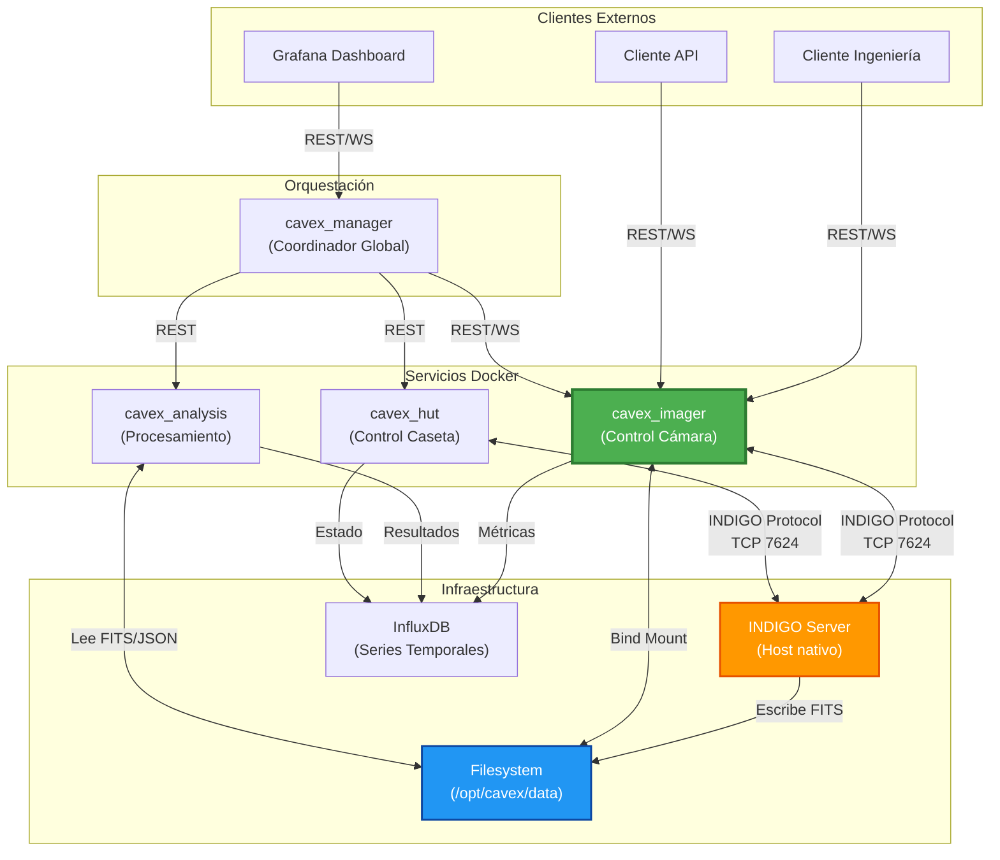

### 2.3 Rol de `cavex_imager`

`cavex_imager` es el **servicio de control de hardware** responsable de:

1. **Abstracción del hardware**: Oculta la complejidad de INDIGO y proporciona una API REST moderna
2. **Gestión de concurrencia**: Garantiza acceso exclusivo y seguro mediante leases
3. **Telemetría**: Publica estado en tiempo real para monitorización
4. **Coordinación de almacenamiento**: Gestiona rutas, nomenclatura y metadatos
5. **Robustez**: Maneja reconexiones, hotplug y errores de forma transparente

---

## 3. Arquitectura del Sistema

### 3.1 Visión General de Capas

`cavex_imager` sigue **Clean Architecture** con separación clara de responsabilidades:

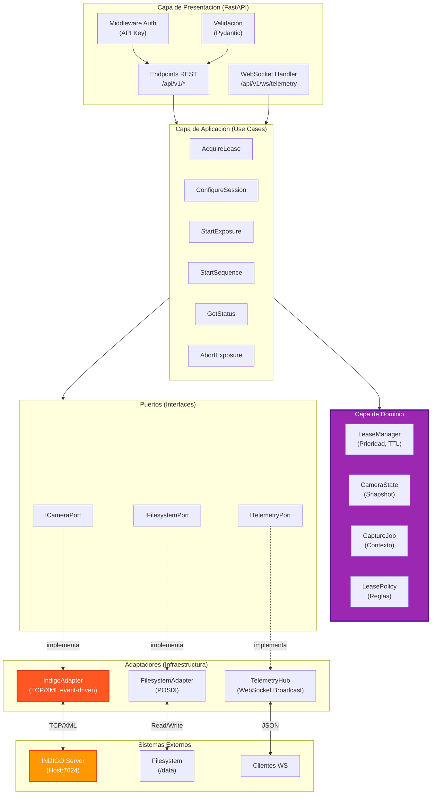

### 3.2 Arquitectura de Despliegue

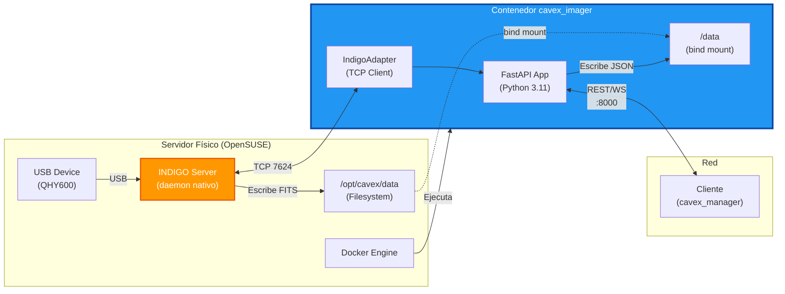

### 3.3 Flujo de Datos

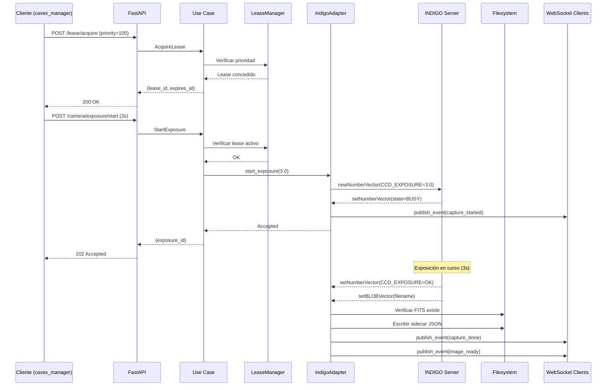

---

## 4. Tecnologías y Stack Técnico

### 4.1 Lenguajes y Frameworks

| Componente | Tecnología | Versión | Justificación |
|------------|------------|---------|---------------|
| **Lenguaje** | Python | 3.11+ | Ecosistema científico, asyncio nativo |
| **Framework Web** | FastAPI | 0.110+ | Async, validación automática, OpenAPI |
| **ASGI Server** | Uvicorn | 0.27+ | Alto rendimiento, WebSocket |
| **Validación** | Pydantic | 2.x | Type safety, validación declarativa |
| **Logging** | structlog | 24.x | Logs estructurados JSON |
| **Testing** | pytest | 8.x | Framework estándar Python |

### 4.2 Protocolos y Comunicación

| Protocolo | Uso | Detalles |
|-----------|-----|----------|
| **INDIGO** | Control de hardware | TCP/XML event-driven, puerto 7624 |
| **HTTP/REST** | API externa | JSON, versionado en URL (/api/v1) |
| **WebSocket** | Telemetría en tiempo real | JSON, 1-2 Hz, broadcast |
| **POSIX** | Filesystem | Bind mount Docker, escritura atómica |

### 4.3 Infraestructura

| Componente | Tecnología | Justificación |
|------------|------------|---------------|
| **Contenedorización** | Docker | Aislamiento, portabilidad, reproducibilidad |
| **Orquestación** | Docker Compose | Simplicidad para single-host |
| **Almacenamiento** | Bind Mount | Acceso directo, sin overhead |
| **Logs** | JSON + Rotado | Agregación (Loki) + auditoría local |
| **Métricas** | Prometheus-compatible | Integración con Grafana |

### 4.4 Dependencias Python Principales

\`\`\`python
# requirements.txt
fastapi==0.110.0
uvicorn[standard]==0.27.0
pydantic==2.6.0
structlog==24.1.0
pytest==8.0.0
pytest-asyncio==0.23.0
httpx==0.26.0  # Cliente HTTP para testing
websockets==12.0  # Cliente WS para testing
\`\`\`

### 4.5 Decisiones Técnicas Clave

#### ¿Por qué INDIGO nativo en el host?

✅ **Acceso directo a USB** sin problemas de permisos  
✅ **Estabilidad**: INDIGO es crítico y debe ser lo más simple posible  
✅ **Soporte multi-dispositivo**: Cámara, HUT, focuser, etc.  

❌ **Alternativa descartada**: INDIGO en contenedor con \`--privileged\`

#### ¿Por qué adaptador TCP/XML event-driven?

✅ **Portabilidad**: Sin dependencias binarias (.so) en el contenedor  
✅ **Compatibilidad**: Funciona con cualquier INDIGO compilado en el host  
✅ **Modelo natural**: INDIGO es asíncrono y push-based  
✅ **Rendimiento suficiente**: Latencia despreciable vs. tiempos de exposición  

❌ **Alternativa descartada**: Binding C nativo (complejidad innecesaria para MVP)

#### ¿Por qué caché local en lugar de polling?

✅ **Latencia cero** en \`GET /status\` (O(1) desde memoria)  
✅ **No saturar INDIGO** con requests repetitivas  
✅ **Alineado con filosofía asíncrona** de INDIGO  

❌ **Alternativa descartada**: Polling periódico (ineficiente)

---

## 5. Componentes del Servicio

### 5.1 Adaptador INDIGO (IndigoAdapter)

#### Responsabilidades

- Mantener conexión TCP persistente con INDIGO Server
- Parsear protocolo XML (def/set/delete Vector)
- Actualizar caché local de estado en tiempo real
- Serializar comandos hacia INDIGO (cola thread-safe)
- Publicar eventos relevantes (exposición, temperatura, alarmas)

#### Arquitectura Interna

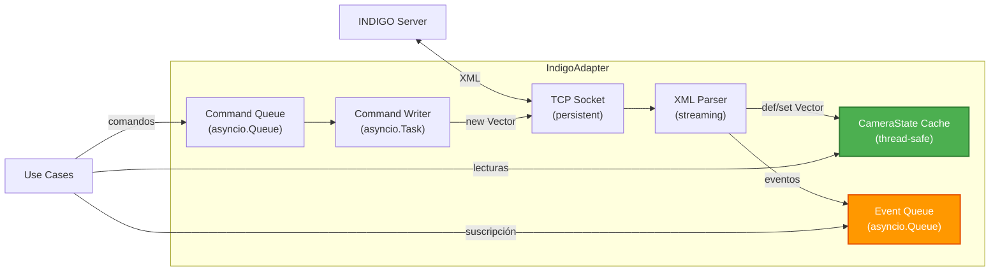

#### Mapeo de Propiedades INDIGO

| Propiedad INDIGO | Tipo | Mapeo en Cache |
|------------------|------|----------------|
| \`CONNECTION\` | Switch | \`connected: bool\` |
| \`CCD_TEMPERATURE\` | Number | \`ccd_temp_c: float\`, \`cooler_target_c: float\` |
| \`CCD_COOLER\` | Switch | \`cooler_on: bool\` |
| \`CCD_COOLER_POWER\` | Number | \`cooler_power_pct: float\` |
| \`CCD_BIN\` | Number | \`bin_x: int\`, \`bin_y: int\` |
| \`CCD_FRAME\` | Number | \`roi: tuple[int, int, int, int]\` |
| \`CCD_GAIN\` | Number | \`gain: Optional[int]\` |
| \`CCD_OFFSET\` | Number | \`offset: Optional[int]\` |
| \`CCD_EXPOSURE\` | Number | \`exposure_state: str\`, \`exposure_value: float\` |
| \`CCD_IMAGE\` | Blob | \`last_image_path: Optional[str]\` |
| \`CCD_FRAME_TYPE\` | Switch | \`frame_type: str\` (LIGHT/DARK/BIAS/FLAT) |
| \`CCD_LOCAL_MODE\` | Text | \`local_mode_dir: str\`, \`local_mode_prefix: str\` |

#### Reconexión Automática

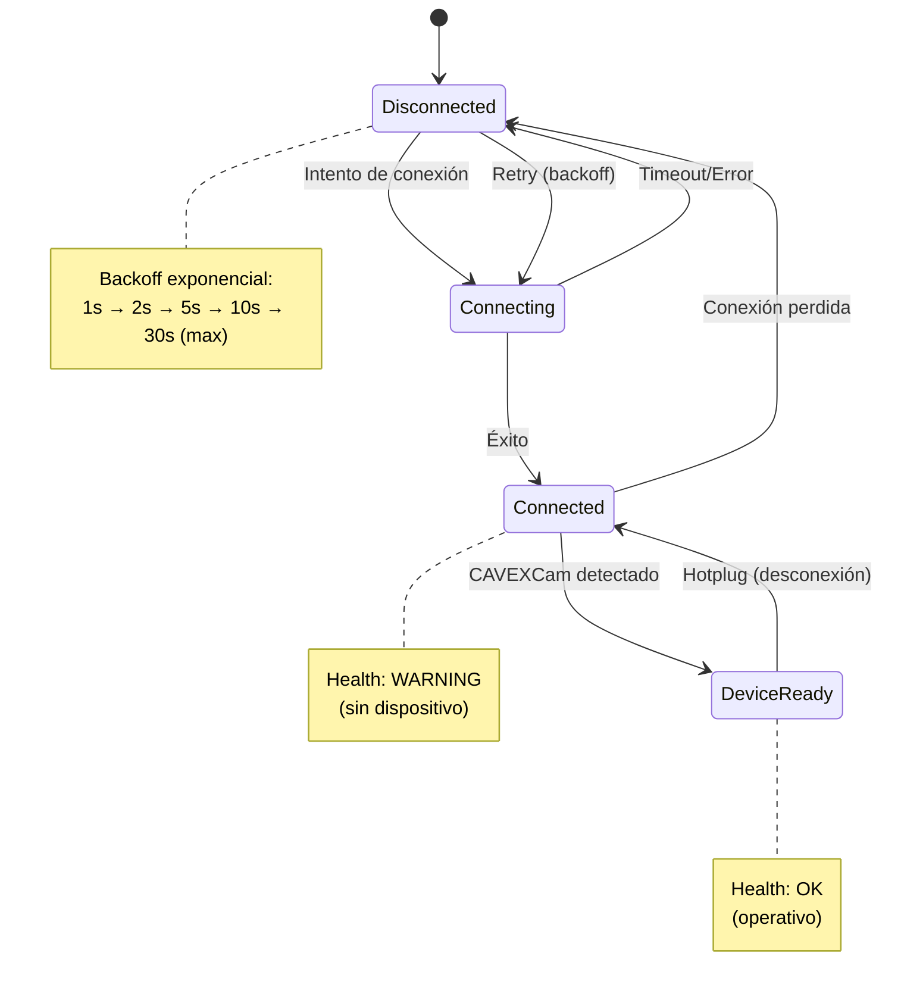

### 5.2 Sistema de Lease (LeaseManager)

#### Modelo de Datos

```python
@dataclass
class Lease:
    lease_id: str           # UUID único
    owner: str              # Identificador del cliente
    priority: int           # Mayor = más prioritario
    acquired_at: datetime   # Timestamp de adquisición
    expires_at: datetime    # Timestamp de expiración
    ttl_seconds: int        # Time To Live
    preempted: bool = False # Marcado si fue preemptado
```

#### Reglas de Negocio

1. **Lecturas sin lease**: \`GET /status\`, \`GET /capabilities\` no requieren lease
2. **Escrituras con lease**: Todos los comandos de control requieren lease activo
3. **Preempción por prioridad**:
   - Si llega \`acquire_lease\` con prioridad mayor, el lease actual se marca como \`preempted\`
   - El nuevo cliente obtiene control inmediatamente
   - El cliente preempted recibe evento WS \`lease_preempted\`
4. **TTL y renovación**:
   - Cada lease tiene TTL (típicamente 60-300s)
   - El cliente debe renovar con \`POST /lease/renew\`
   - Si expira, se libera automáticamente

#### Política de Preempción

```yaml
lease:
  preempt_mode: "graceful"  # o "abort"
  default_ttl_seconds: 120
  max_ttl_seconds: 600
```

**Modos**:
- \`graceful\`: No aborta exposición en curso, pero impide nuevos comandos del lease preemptado
- \`abort\`: Aborta exposición en curso al preemptar (si el driver soporta abort)

#### Diagrama de Estados

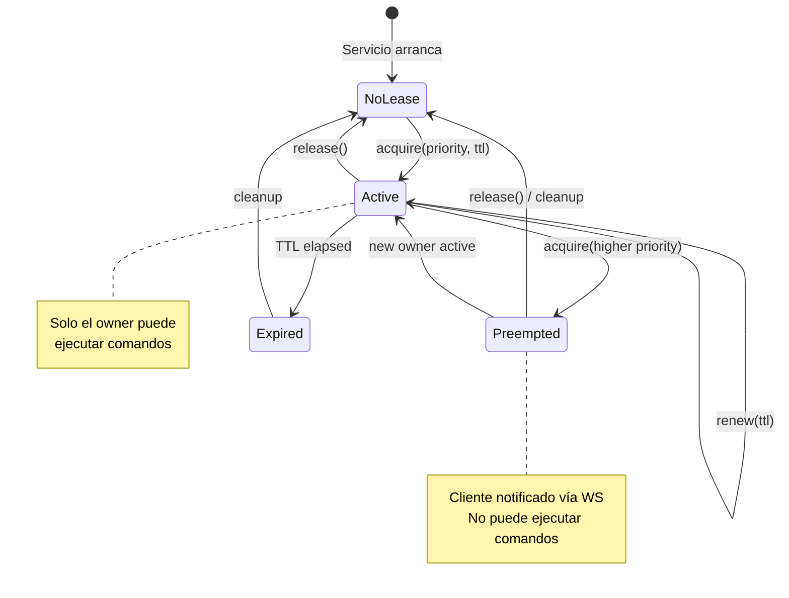

### 5.3 TelemetryHub (WebSocket)

#### Responsabilidades

- Gestionar conexiones WebSocket de múltiples clientes
- Broadcast de mensajes a todos los clientes conectados
- Control de cadencia (1-2 Hz) con jitter mínimo
- Filtrado opcional por tipo de evento

#### Tipos de Mensajes

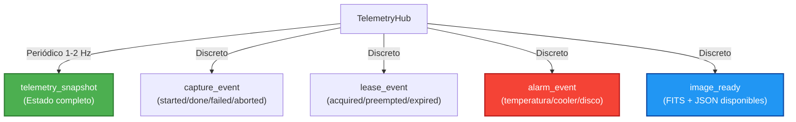

#### Ejemplo de Mensaje

```json
{
  "type": "telemetry_snapshot",
  "timestamp": "2026-02-12T22:00:00.123Z",
  "data": {
    "device": {
      "name": "CAVEXCam",
      "connected": true
    },
    "status": {
      "state": "BUSY",
      "exposure": {
        "is_exposing": true,
        "elapsed_s": 1.5,
        "total_s": 3.0,
        "progress_pct": 50.0
      },
      "thermal": {
        "ccd_temp_c": -10.2,
        "target_temp_c": -10.0,
        "cooler_on": true,
        "cooler_power_pct": 45.5,
        "cooler_state": "STABLE"
      }
    },
    "config": {
      "binning": [1, 1],
      "roi": [0, 0, 9600, 6422],
      "gain": 26,
      "offset": 10
    },
    "lease": {
      "active": true,
      "owner": "cavex_manager",
      "priority": 100,
      "expires_in_s": 45
    }
  }
}
```

### 5.4 FilesystemAdapter

#### Responsabilidades

- Validar rutas de sesión (seguridad, permisos)
- Verificar espacio en disco disponible
- Escribir sidecar JSON de forma atómica (tmp + rename)
- Detectar archivos FITS escritos por INDIGO

#### Escritura Atómica de Sidecar

```python
def write_sidecar(self, fits_path: str, metadata: dict):
    json_path = fits_path.replace('.fits', '.json')
    tmp_path = json_path + '.tmp'

    # Escribir a archivo temporal
    with open(tmp_path, 'w') as f:
        json.dump(metadata, f, indent=2)

    # Rename atómico
    os.rename(tmp_path, json_path)
```

#### Estructura de Sidecar JSON

```json
{
  "filename": "cavex_0042.fits",
  "timestamp_utc": "2026-02-12T22:00:03.123Z",
  "device": {
    "name": "CAVEXCam",
    "model": "QHY600"
  },
  "acquisition": {
    "exptime_s": 3.0,
    "frame_type": "LIGHT",
    "gain": 26,
    "offset": 10,
    "binning": [1, 1],
    "roi": [0, 0, 9600, 6422]
  },
  "thermal": {
    "ccd_temp_c": -10.2,
    "cooler_power_pct": 45.5
  },
  "context": {
    "lease_owner": "cavex_manager",
    "job_id": "night_001",
    "sequence_id": null,
    "exposure_id": "exp_a1b2c3d4"
  },
  "cavex": {
    "service_version": "1.0.0",
    "indigo_version": "2.0.300"
  }
}
```

---

## 6. Flujos de Operación

### 6.1 Flujo Completo de Captura

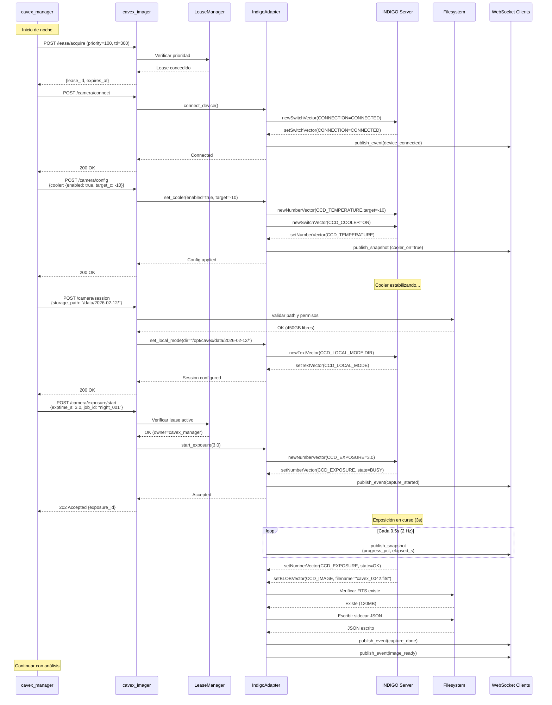

### 6.2 Flujo de Preempción

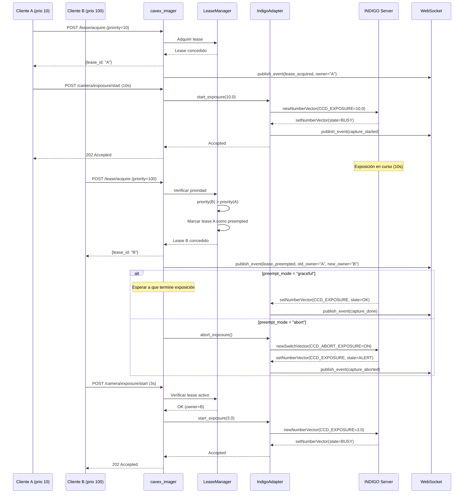

### 6.3 Flujo de Reconexión INDIGO

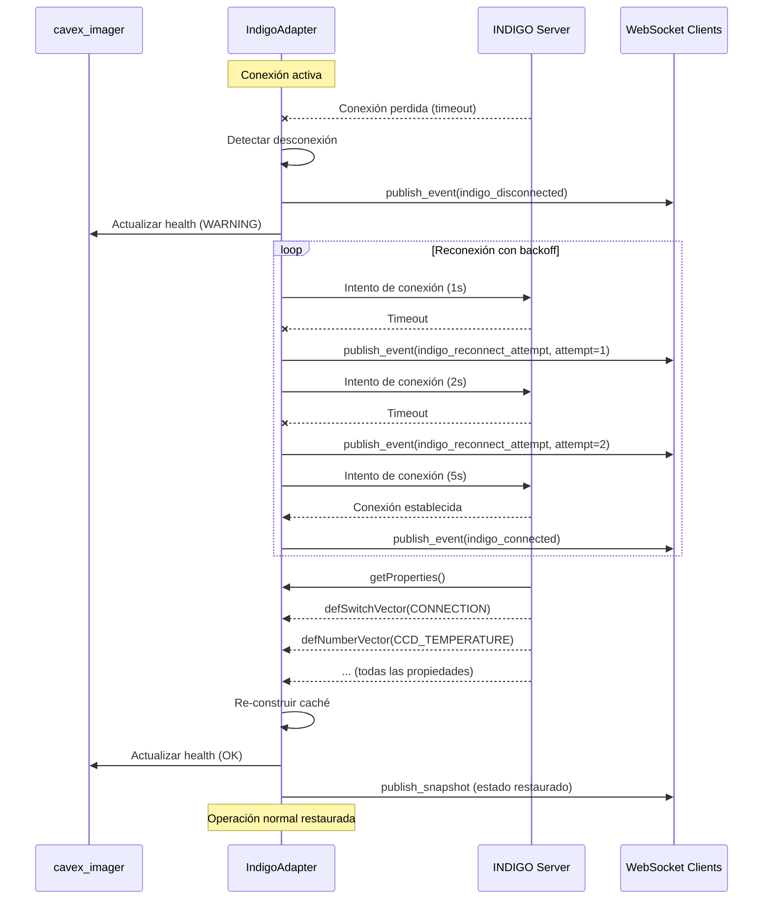

### 6.4 Flujo de Secuencia Programada

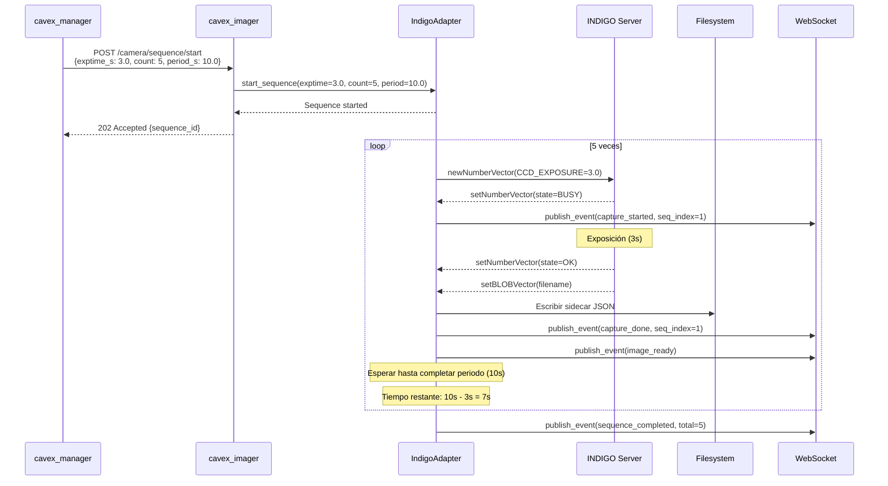

---

## 7. API REST y WebSocket

### 7.1 Convenciones Generales

- **Base URL**: \`/api/v1\`
- **Formato**: JSON (request y response)
- **Autenticación**: Header \`X-API-Key\` (opcional pero recomendado)
- **Errores**: Formato consistente con \`correlation_id\`
- **Versionado**: En la URL (\`/v1\`), permite evolución futura

### 7.2 Endpoints Principales

#### Health y Diagnóstico

```
GET /api/v1/health
GET /api/v1/diag/summary
GET /api/v1/diag/last_errors
```

#### Estado y Capacidades

```
GET /api/v1/camera/status
GET /api/v1/camera/capabilities
```

#### Gestión de Lease

```
POST /api/v1/lease/acquire
POST /api/v1/lease/renew
POST /api/v1/lease/release
GET  /api/v1/lease/status
```

#### Control de Cámara

```
POST /api/v1/camera/connect
POST /api/v1/camera/disconnect
POST /api/v1/camera/config
POST /api/v1/camera/session
```

#### Captura

```
POST /api/v1/camera/exposure/start
POST /api/v1/camera/exposure/abort
POST /api/v1/camera/sequence/start
POST /api/v1/camera/sequence/stop
```

### 7.3 Ejemplos de Uso

#### Adquirir Lease

**Request**:
```bash
curl -X POST http://localhost:8000/api/v1/lease/acquire \
  -H "X-API-Key: cavex_manager_key_12345" \
  -H "Content-Type: application/json" \
  -d '{
    "owner": "cavex_manager",
    "priority": 100,
    "ttl_seconds": 300
  }'
```

**Response**:
```json
{
  "lease_id": "lease_a1b2c3d4",
  "owner": "cavex_manager",
  "priority": 100,
  "acquired_at": "2026-02-12T22:00:00Z",
  "expires_at": "2026-02-12T22:05:00Z"
}
```

#### Iniciar Exposición

**Request**:
```bash
curl -X POST http://localhost:8000/api/v1/camera/exposure/start \
  -H "X-API-Key: cavex_manager_key_12345" \
  -H "Content-Type: application/json" \
  -d '{
    "exptime_s": 3.0,
    "frame_type": "LIGHT",
    "job_id": "night_001"
  }'
```

**Response**:
```json
{
  "exposure_id": "exp_a1b2c3d4",
  "exptime_s": 3.0,
  "started_at": "2026-02-12T22:00:00Z",
  "estimated_done_at": "2026-02-12T22:00:03Z"
}
```

#### Consultar Estado

**Request**:
```bash
curl http://localhost:8000/api/v1/camera/status
```

**Response**:
```json
{
  "timestamp": "2026-02-12T22:00:00.123Z",
  "device": {
    "name": "CAVEXCam",
    "model": "QHY600",
    "connected": true
  },
  "indigo": {
    "connected": true,
    "server": "172.17.0.1:7624"
  },
  "status": {
    "state": "IDLE",
    "exposure": {
      "is_exposing": false,
      "elapsed_s": 0.0,
      "total_s": 0.0,
      "progress_pct": 0.0
    },
    "thermal": {
      "ccd_temp_c": -10.2,
      "target_temp_c": -10.0,
      "cooler_on": true,
      "cooler_power_pct": 45.5,
      "cooler_state": "STABLE"
    }
  },
  "config": {
    "binning": [1, 1],
    "roi": [0, 0, 9600, 6422],
    "gain": 26,
    "offset": 10
  },
  "storage": {
    "session_path": "/data/2026-02-12/",
    "last_file": "cavex_0042.fits",
    "disk_free_gb": 450.2
  },
  "lease": {
    "active": true,
    "lease_id": "lease_a1b2c3d4",
    "owner": "cavex_manager",
    "priority": 100,
    "expires_in_s": 245
  }
}
```

### 7.4 WebSocket de Telemetría

#### Conexión

```javascript
const ws = new WebSocket('ws://localhost:8000/api/v1/ws/telemetry?rate_hz=2');

ws.onmessage = (event) => {
  const msg = JSON.parse(event.data);

  switch(msg.type) {
    case 'telemetry_snapshot':
      updateDashboard(msg.data);
      break;
    case 'capture_event':
      handleCaptureEvent(msg.data);
      break;
    case 'alarm_event':
      showAlert(msg.data);
      break;
  }
};
```

#### Tipos de Mensajes

| Tipo | Frecuencia | Descripción |
|------|------------|-------------|
| \`telemetry_snapshot\` | 1-2 Hz | Estado completo (temperatura, progreso, config) |
| \`capture_event\` | Discreto | Inicio/fin/fallo/abort de captura |
| \`lease_event\` | Discreto | Cambios en el lease (acquired/preempted/expired) |
| \`alarm_event\` | Discreto | Alarmas (temperatura, cooler, disco) |
| \`image_ready\` | Discreto | FITS + JSON disponibles para análisis |

---

## 8. Instalación y Configuración

### 8.1 Requisitos Previos

#### Hardware

- **Servidor**: x86_64, 8GB RAM, 500GB disco
- **Cámara**: QHY600 (USB 3.0)
- **Red**: Ethernet 1Gbps (para transferencia de imágenes)

#### Software

- **OS**: OpenSUSE Leap 15.5+ (o compatible)
- **Docker**: 24.0+
- **Docker Compose**: 2.20+
- **INDIGO Server**: 2.0.300+ (compilado e instalado en el host)

### 8.2 Instalación de INDIGO (Host)

\`\`\`bash
# Clonar repositorio INDIGO
git clone https://github.com/indigo-astronomy/indigo.git
cd indigo

# Compilar con drivers QHY
make all
sudo make install

# Instalar driver QHY
cd indigo_drivers/ccd_qhy
make
sudo make install

# Iniciar INDIGO server como daemon
sudo systemctl enable indigo
sudo systemctl start indigo

# Verificar que está escuchando en puerto 7624
sudo netstat -tlnp | grep 7624
\`\`\`

### 8.3 Preparación del Filesystem

```bash
# Crear directorios
sudo mkdir -p /opt/cavex/data
sudo mkdir -p /opt/cavex/config
sudo mkdir -p /opt/cavex/data/logs

# Permisos (ajustar según usuario Docker)
sudo chown -R 1000:1000 /opt/cavex/data
sudo chmod -R 755 /opt/cavex/data
```

### 8.4 Configuración del Servicio

#### Archivo de Configuración

Crear \`/opt/cavex/config/cavex_imager.yaml\`:

```yaml
service:
  name: cavex_imager
  version: 1.0.0
  log_level: INFO

indigo:
  host: 172.17.0.1  # IP del host desde Docker
  port: 7624
  device_name: CAVEXCam
  reconnect:
    enabled: true
    max_attempts: 0  # infinito
    backoff_max_s: 30

auth:
  enabled: true
  keys:
    - key: "cavex_manager_key_12345"
      owner: "cavex_manager"
      priority: 100
    - key: "engineering_key_67890"
      owner: "engineering"
      priority: 50

lease:
  preempt_mode: graceful
  default_ttl_seconds: 120
  max_ttl_seconds: 600

storage:
  host_base_path: /opt/cavex/data
  container_base_path: /data
  min_free_gb: 10
  default_file_prefix: cavex
  default_naming_pattern: "{prefix}_{seq:04d}.fits"

telemetry:
  default_rate_hz: 1
  max_ws_clients: 10

logging:
  stdout:
    enabled: true
    format: json
  file:
    enabled: true
    path: /data/logs/cavex_imager.log
    max_bytes: 10485760  # 10MB
    backup_count: 5
    compress: true
```

### 8.5 Docker Compose

Crear \`/opt/cavex/docker-compose.yml\`:

\`\`\`yaml
version: '3.8'

services:
  cavex_imager:
    image: caha/cavex_imager:1.0.0
    container_name: cavex_imager
    restart: unless-stopped

    volumes:
      - /opt/cavex/data:/data
      - /opt/cavex/config:/config:ro

    environment:
      - LOG_LEVEL=INFO
      - INDIGO_HOST=172.17.0.1
      - INDIGO_PORT=7624

    ports:
      - "8001:8000"  # API REST + WebSocket

    logging:
      driver: "json-file"
      options:
        max-size: "10m"
        max-file: "3"

    networks:
      - cavex_network

    healthcheck:
      test: ["CMD", "curl", "-f", "http://localhost:8000/api/v1/health"]
      interval: 30s
      timeout: 10s
      retries: 3
      start_period: 10s

networks:
  cavex_network:
    driver: bridge
\`\`\`

### 8.6 Despliegue

```bash
# Navegar al directorio
cd /opt/cavex

# Descargar imagen Docker (o build local)
docker pull caha/cavex_imager:1.0.0

# Iniciar servicio
docker-compose up -d cavex_imager

# Verificar logs
docker logs -f cavex_imager

# Verificar health
curl http://localhost:8001/api/v1/health
```

### 8.7 Verificación de Instalación

```bash
# 1. Verificar INDIGO está corriendo
sudo systemctl status indigo

# 2. Verificar contenedor está corriendo
docker ps | grep cavex_imager

# 3. Verificar conectividad INDIGO
curl http://localhost:8001/api/v1/diag/summary | jq '.indigo'

# 4. Verificar dispositivo detectado
curl http://localhost:8001/api/v1/camera/status | jq '.device'

# 5. Verificar WebSocket
wscat -c ws://localhost:8001/api/v1/ws/telemetry?rate_hz=1
```

---

## 9. Monitorización y Observabilidad

### 9.1 Estrategia de Observabilidad

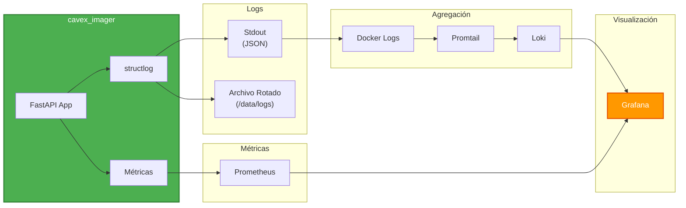

### 9.2 Logs Estructurados

#### Formato JSON

```json
{
  "timestamp": "2026-02-12T22:15:00.456Z",
  "level": "INFO",
  "event": "exposure_started",
  "service": "cavex_imager",
  "correlation_id": "a1b2c3d4",
  "lease_owner": "cavex_manager",
  "params": {
    "exptime": 3.0,
    "frame_type": "LIGHT",
    "job_id": "night_001"
  },
  "context": {
    "device": "CAVEXCam",
    "session_path": "/data/2026-02-12/"
  }
}
```

#### Consulta de Logs

```bash
# Logs en tiempo real
docker logs -f cavex_imager

# Filtrar por evento
docker logs cavex_imager | jq 'select(.event == "exposure_started")'

# Filtrar por nivel
docker logs cavex_imager | jq 'select(.level == "ERROR")'

# Filtrar por correlation_id
docker logs cavex_imager | jq 'select(.correlation_id == "a1b2c3d4")'

# Logs históricos (archivo rotado)
zcat /opt/cavex/data/logs/cavex_imager.log.1.gz | jq
```

### 9.3 Métricas

#### Endpoint de Métricas

```bash
curl http://localhost:8001/api/v1/diag/metrics
```

#### Métricas Disponibles

| Métrica | Tipo | Descripción |
|---------|------|-------------|
| \`captures_total\` | Counter | Total de capturas completadas |
| \`captures_failed_total\` | Counter | Total de capturas fallidas |
| \`last_capture_duration_s\` | Gauge | Duración de la última captura |
| \`indigo_connected\` | Gauge | Estado de conexión INDIGO (0/1) |
| \`device_connected\` | Gauge | Estado de conexión del dispositivo (0/1) |
| \`ws_clients_connected\` | Gauge | Número de clientes WebSocket |
| \`lease_active\` | Gauge | Lease activo (0/1) |
| \`ccd_temp_c\` | Gauge | Temperatura del CCD |
| \`cooler_power_pct\` | Gauge | Potencia del cooler |
| \`disk_free_gb\` | Gauge | Espacio libre en disco |

### 9.4 Health Checks

#### Endpoint de Health

```bash
curl http://localhost:8001/api/v1/health
```

#### Estados Posibles

| Estado | Descripción | Acción |
|--------|-------------|--------|
| \`OK\` | Todo operativo | Ninguna |
| \`WARNING\` | Funcional con problemas menores | Monitorizar |
| \`ERROR\` | No operativo | Intervención requerida |

#### Checks Individuales

```json
{
  "status": "OK",
  "checks": {
    "indigo_server": "CONNECTED",
    "camera_device": "READY",
    "storage_writable": "YES",
    "disk_space": "OK",
    "last_exposure": "SUCCESS",
    "active_alerts": 0
  }
}
```

### 9.5 Alarmas

#### Tipos de Alarmas

| Código | Severidad | Descripción | Umbral |
|--------|-----------|-------------|--------|
| \`COOLER_HIGH_POWER\` | WARNING | Cooler al 100% sostenido | >5 min |
| \`TEMP_DEVIATION\` | WARNING | Temperatura fuera de target | >5°C por >60s |
| \`DISK_SPACE_LOW\` | ERROR | Espacio en disco bajo | <10GB |
| \`INDIGO_DISCONNECTED\` | ERROR | INDIGO server no disponible | - |
| \`DEVICE_DISCONNECTED\` | ERROR | Dispositivo desconectado | - |

#### Notificación de Alarmas

Las alarmas se publican por:
1. **WebSocket**: Evento \`alarm_event\`
2. **Logs**: Nivel \`ERROR\` o \`WARNING\`
3. **Métricas**: Gauge \`active_alerts\`

### 9.6 Dashboard Grafana

#### Paneles Recomendados

1. **Estado General**
   - Health status (OK/WARNING/ERROR)
   - Conexión INDIGO (gauge)
   - Conexión dispositivo (gauge)
   - Lease activo (gauge)

2. **Telemetría Térmica**
   - Temperatura CCD (time series)
   - Temperatura target (line)
   - Potencia cooler (time series)
   - Estado cooler (stat)

3. **Capturas**
   - Capturas totales (counter)
   - Capturas fallidas (counter)
   - Duración última captura (gauge)
   - Progreso exposición actual (gauge)

4. **Almacenamiento**
   - Espacio libre (gauge)
   - Imágenes por noche (counter)
   - Tamaño total (gauge)

5. **Clientes**
   - Clientes WebSocket (gauge)
   - Lease owner (stat)
   - Lease expires_in (gauge)

---

## 10. Casos de Uso

### 10.1 Operación Automática Nocturna

**Actor**: \`cavex_manager\` (orquestador)

**Flujo**:
1. Al atardecer, \`cavex_manager\` adquiere lease con prioridad 100
2. Conecta la cámara y activa el cooler (-10°C)
3. Espera a que el cooler se estabilice (monitoriza vía WS)
4. Configura sesión de almacenamiento (\`/data/2026-02-12/\`)
5. Inicia secuencia de exposiciones (3s cada 10s, infinito)
6. Monitoriza telemetría y reacciona a alarmas
7. Al amanecer, detiene la secuencia y libera el lease

**Ventajas**:
- Control exclusivo garantizado (prioridad alta)
- Telemetría en tiempo real para decisiones
- Recuperación automática ante fallos de INDIGO
- Metadatos completos para análisis posterior

### 10.2 Calibración Manual por Ingeniería

**Actor**: Ingeniero (cliente de baja prioridad)

**Flujo**:
1. Ingeniero adquiere lease con prioridad 50
2. Conecta la cámara y configura parámetros (ROI, binning, gain)
3. Ejecuta exposiciones de prueba (BIAS, DARK, FLAT)
4. Verifica temperatura y estado del cooler
5. Si llega el orquestador (prioridad 100), el lease es preemptado
6. Ingeniero recibe notificación WS y libera el control

**Ventajas**:
- Acceso flexible para diagnóstico
- Preempción automática por operación prioritaria
- No interfiere con operación nocturna

### 10.3 Monitorización en Dashboard

**Actor**: Dashboard Grafana

**Flujo**:
1. Dashboard se conecta al WebSocket (rate_hz=1)
2. Recibe snapshots periódicos con temperatura, progreso, estado
3. Muestra gráficos en tiempo real
4. Recibe alarmas y las muestra como notificaciones
5. No requiere lease (solo lectura)

**Ventajas**:
- Visibilidad completa sin interferir con operación
- Detección temprana de problemas (temperatura, cooler)
- Histórico de métricas en InfluxDB

### 10.4 Análisis Automático de Imágenes

**Actor**: \`cavex_analysis\` (servicio de procesamiento)

**Flujo**:
1. \`cavex_analysis\` se suscribe al WebSocket
2. Recibe evento \`image_ready\` con \`image_path\` y \`sidecar_path\`
3. Lee FITS y JSON desde el filesystem compartido
4. Ejecuta fotometría y cálculo de extinción
5. Publica resultados en InfluxDB

**Ventajas**:
- No requiere polling del filesystem
- Latencia mínima entre captura y análisis
- Metadatos completos en JSON para contexto

### 10.5 Intervención de Emergencia

**Actor**: Operador (prioridad máxima)

**Flujo**:
1. Operador detecta problema (nubes, fallo mecánico)
2. Adquiere lease con prioridad 200 (máxima)
3. Preempta al orquestador (modo \`abort\`)
4. Aborta exposición en curso
5. Desconecta la cámara y apaga el cooler
6. Libera el lease

**Ventajas**:
- Control inmediato en situaciones críticas
- Preempción con abort para detener operación rápidamente
- Logs completos para auditoría posterior

---

## 11. Ventajas y Bondades

### 11.1 Arquitectura de Microservicios

✅ **Separación de responsabilidades**: Cada servicio tiene un propósito claro  
✅ **Escalabilidad**: Fácil añadir nuevos dispositivos (focuser, dome, mount)  
✅ **Mantenibilidad**: Código modular y testeable  
✅ **Despliegue independiente**: Actualizar un servicio sin afectar a otros  
✅ **Resiliencia**: Fallo de un servicio no afecta al resto  

### 11.2 Dockerización

✅ **Portabilidad**: Funciona en cualquier host con Docker  
✅ **Reproducibilidad**: Mismo entorno en desarrollo y producción  
✅ **Aislamiento**: No contamina el sistema host  
✅ **Versionado**: Imágenes Docker versionadas y trazables  
✅ **Rollback rápido**: Volver a versión anterior en segundos  

### 11.3 INDIGO Nativo en Host

✅ **Acceso directo a USB**: Sin problemas de permisos  
✅ **Estabilidad**: INDIGO crítico fuera de Docker  
✅ **Soporte multi-dispositivo**: Un solo INDIGO para todos los servicios  
✅ **Drivers nativos**: Compilados para el sistema host  

### 11.4 Adaptador TCP/XML Event-Driven

✅ **Latencia cero en lecturas**: Caché local actualizado por eventos  
✅ **No saturar INDIGO**: Sin polling repetitivo  
✅ **Modelo natural**: Alineado con filosofía asíncrona de INDIGO  
✅ **Portabilidad**: Sin dependencias binarias en el contenedor  

### 11.5 Sistema de Lease con Prioridades

✅ **Concurrencia segura**: Solo un cliente puede escribir a la vez  
✅ **Priorización**: Operación automática prevalece sobre manual  
✅ **Recuperación automática**: TTL evita bloqueos permanentes  
✅ **Preempción controlada**: Modo \`graceful\` o \`abort\` según necesidad  

### 11.6 Telemetría en Tiempo Real

✅ **Visibilidad completa**: Temperatura, progreso, estado en tiempo real  
✅ **Detección temprana**: Alarmas antes de perder datos  
✅ **Sin interferencia**: Lecturas no requieren lease  
✅ **Múltiples clientes**: Dashboard, orquestador, ingeniería simultáneamente  

### 11.7 Almacenamiento Robusto

✅ **FITS + JSON sidecar**: Metadatos extendidos sin modificar FITS  
✅ **Escritura atómica**: Sin archivos corruptos  
✅ **Evento \`image_ready\`**: Sin polling del filesystem  
✅ **Bind mount**: Acceso directo sin overhead de red  

### 11.8 Observabilidad

✅ **Logs estructurados**: JSON para agregación y análisis  
✅ **Métricas**: Prometheus-compatible para Grafana  
✅ **Health checks**: Estado global y por subsistema  
✅ **Correlation ID**: Trazabilidad completa de operaciones  

### 11.9 Robustez

✅ **Reconexión automática**: INDIGO, dispositivo, clientes WS  
✅ **Manejo de hotplug**: Desconexión/reconexión de cámara  
✅ **Validaciones**: Parámetros, permisos, espacio en disco  
✅ **Recuperación ante fallos**: Sin intervención manual  

### 11.10 API Moderna

✅ **REST + WebSocket**: Estándares de la industria  
✅ **OpenAPI**: Documentación automática  
✅ **Validación automática**: Pydantic  
✅ **Versionado**: Evolución sin romper compatibilidad  

---

## 12. Troubleshooting

### 12.1 Problemas Comunes

#### Servicio no arranca

**Síntomas**: Contenedor se detiene inmediatamente

**Diagnóstico**:
```bash
docker logs cavex_imager
```

**Causas comunes**:
- Archivo de configuración inválido
- Puerto 8000 ya en uso
- Bind mount no accesible

**Solución**:
```bash
# Verificar configuración
cat /opt/cavex/config/cavex_imager.yaml

# Verificar puerto
sudo netstat -tlnp | grep 8000

# Verificar permisos
ls -la /opt/cavex/data
```

#### INDIGO no conecta

**Síntomas**: \`health\` reporta \`indigo_server: DISCONNECTED\`

**Diagnóstico**:
```bash
# Verificar INDIGO está corriendo
sudo systemctl status indigo

# Verificar puerto
sudo netstat -tlnp | grep 7624

# Verificar desde contenedor
docker exec cavex_imager nc -zv 172.17.0.1 7624
```

**Solución**:
```bash
# Reiniciar INDIGO
sudo systemctl restart indigo

# Verificar logs INDIGO
sudo journalctl -u indigo -f
```

#### Dispositivo no detectado

**Síntomas**: \`device_connected: false\`

**Diagnóstico**:
```bash
# Verificar USB
lsusb | grep QHY

# Verificar INDIGO detecta el dispositivo
indigo_prop_tool list
```

**Solución**:
```bash
# Reconectar USB
# Reiniciar INDIGO
sudo systemctl restart indigo

# Verificar permisos USB
sudo chmod 666 /dev/bus/usb/XXX/YYY
```

#### Lease expirado constantemente

**Síntomas**: Cliente pierde lease antes de renovar

**Diagnóstico**:
```bash
# Verificar TTL configurado
curl http://localhost:8001/api/v1/lease/status | jq
```

**Solución**:
- Aumentar TTL en la configuración
- Reducir intervalo de renovación en el cliente
- Verificar latencia de red

#### Espacio en disco lleno

**Síntomas**: Capturas fallan con \`IO_ERROR\`

**Diagnóstico**:
```bash
df -h /opt/cavex/data
```

**Solución**:
```bash
# Limpiar imágenes antiguas
find /opt/cavex/data -name "*.fits" -mtime +30 -delete

# Comprimir imágenes
gzip /opt/cavex/data/2026-01-*/*.fits
```

#### Temperatura no estabiliza

**Síntomas**: \`cooler_power_pct: 100\`, temperatura no alcanza target

**Diagnóstico**:
```bash
curl http://localhost:8001/api/v1/camera/status | jq '.status.thermal'
```

**Causas comunes**:
- Target demasiado bajo para temperatura ambiente
- Cooler defectuoso
- Ventilación insuficiente

**Solución**:
- Aumentar target (ej: -5°C en lugar de -10°C)
- Verificar ventilación del sistema
- Contactar soporte técnico si persiste

### 12.2 Comandos de Diagnóstico

```bash
# Estado general
curl http://localhost:8001/api/v1/health | jq

# Diagnóstico detallado
curl http://localhost:8001/api/v1/diag/summary | jq

# Últimos errores
curl http://localhost:8001/api/v1/diag/last_errors | jq

# Estado de la cámara
curl http://localhost:8001/api/v1/camera/status | jq

# Estado del lease
curl http://localhost:8001/api/v1/lease/status | jq

# Logs en tiempo real
docker logs -f cavex_imager

# Logs filtrados por error
docker logs cavex_imager | jq 'select(.level == "ERROR")'

# Métricas
curl http://localhost:8001/api/v1/diag/metrics
```

### 12.3 Reinicio Seguro

```bash
# 1. Verificar que no hay exposición en curso
curl http://localhost:8001/api/v1/camera/status | jq '.status.exposure.is_exposing'

# 2. Si hay exposición, esperar o abortar
curl -X POST http://localhost:8001/api/v1/camera/exposure/abort \
  -H "X-API-Key: engineering_key_67890"

# 3. Reiniciar contenedor
docker-compose restart cavex_imager

# 4. Verificar health
curl http://localhost:8001/api/v1/health | jq
```

### 12.4 Recuperación ante Fallo Crítico

```bash
# 1. Detener servicio
docker-compose stop cavex_imager

# 2. Verificar INDIGO
sudo systemctl status indigo

# 3. Verificar filesystem
df -h /opt/cavex/data
ls -la /opt/cavex/data

# 4. Verificar logs
docker logs cavex_imager | tail -100

# 5. Reiniciar desde cero
docker-compose down
docker-compose up -d cavex_imager

# 6. Monitorizar arranque
docker logs -f cavex_imager
```

---

## 13. Referencias

### 13.1 Documentación Técnica

- [INDIGO Astronomy](https://www.indigo-astronomy.org/)
- [INDIGO Client Development Basics](https://github.com/indigo-astronomy/indigo/blob/master/indigo_docs/CLIENT_DEVELOPMENT_BASICS.md)
- [INDIGO Properties](https://github.com/indigo-astronomy/indigo/blob/master/indigo_docs/PROPERTIES.md)
- [FastAPI Documentation](https://fastapi.tiangolo.com/)
- [Pydantic Documentation](https://docs.pydantic.dev/)
- [Structlog Documentation](https://www.structlog.org/)

### 13.2 Estándares y Protocolos

- [ASCOM Alpaca API](https://ascom-standards.org/api/)
- [FITS Standard](https://fits.gsfc.nasa.gov/)
- [WebSocket Protocol (RFC 6455)](https://datatracker.ietf.org/doc/html/rfc6455)
- [OpenAPI Specification](https://swagger.io/specification/)

### 13.3 Herramientas

- [Docker Documentation](https://docs.docker.com/)
- [Docker Compose](https://docs.docker.com/compose/)
- [Grafana](https://grafana.com/docs/)
- [Prometheus](https://prometheus.io/docs/)
- [Loki](https://grafana.com/docs/loki/)

### 13.4 Contacto

**Equipo CAVEX_V2**  
Observatorio de Calar Alto  
Email: cavex-dev@caha.es  
Web: https://www.caha.es

---

## Apéndice A: Glosario

| Término | Definición |
|---------|------------|
| **INDIGO** | Bus de comunicación para dispositivos astronómicos (sucesor de INDI) |
| **CABLE** | Patrón "Device Service" para abstracción de hardware en CAVEX_V2 |
| **Lease** | Control exclusivo temporal con prioridad y TTL |
| **Preempción** | Toma de control por un cliente de mayor prioridad |
| **Sidecar** | Archivo auxiliar con metadatos (JSON) asociado a un FITS |
| **Bind Mount** | Mapeo de directorio del host a contenedor Docker |
| **Hotplug** | Conexión/desconexión de dispositivo USB en caliente |
| **TTL** | Time To Live, tiempo de validez de un lease |
| **ROI** | Region Of Interest, subregión del sensor a leer |
| **Binning** | Agrupación de píxeles para reducir resolución y ruido |
| **Cooler** | Sistema de refrigeración del sensor CCD |
| **Frame Type** | Tipo de imagen (LIGHT/DARK/BIAS/FLAT) |

---

## Apéndice B: Códigos de Error

| Código | HTTP | Descripción | Acción |
|--------|------|-------------|--------|
| \`VALIDATION_ERROR\` | 400 | Parámetros inválidos | Corregir request |
| \`UNAUTHORIZED\` | 401 | API key inválida | Verificar credenciales |
| \`FORBIDDEN\` | 403 | Sin lease activo | Adquirir lease |
| \`DEVICE_NOT_FOUND\` | 404 | Dispositivo no detectado | Verificar USB/INDIGO |
| \`CONFLICT\` | 409 | Operación incompatible | Esperar o abortar |
| \`INDIGO_UNAVAILABLE\` | 503 | INDIGO no responde | Verificar INDIGO |
| \`INDIGO_TIMEOUT\` | 504 | Timeout INDIGO | Reintentar |
| \`IO_ERROR\` | 500 | Error filesystem | Verificar permisos/espacio |
| \`INTERNAL_ERROR\` | 500 | Error inesperado | Revisar logs |

---

## Apéndice C: Puertos y Conectividad

| Servicio | Puerto | Protocolo | Descripción |
|----------|--------|-----------|-------------|
| INDIGO Server | 7624 | TCP | Protocolo INDIGO (XML) |
| cavex_imager API | 8000 | HTTP/WS | REST + WebSocket |
| cavex_imager (host) | 8001 | HTTP/WS | Mapeado desde contenedor |
| Prometheus | 9090 | HTTP | Métricas (opcional) |
| Grafana | 3000 | HTTP | Dashboard (opcional) |

---

**Fin del Documento**

---

**Historial de Versiones**

| Versión | Fecha | Cambios |
|---------|-------|---------|
| 1.0 | 2026-02-10 | Versión inicial |
| 1.1 | 2026-02-10 | Añadidos datos térmicos |
| 1.2 | 2026-02-10 | Añadida estrategia de logging |
| 1.3 | 2026-02-12 | Documento técnico completo con diagramas Mermaid |
