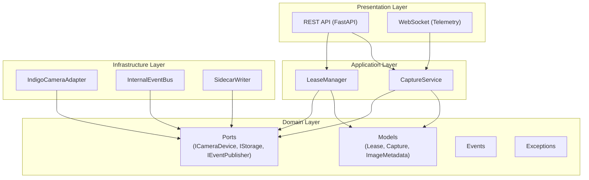
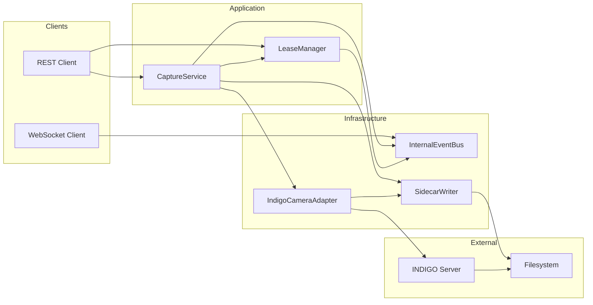
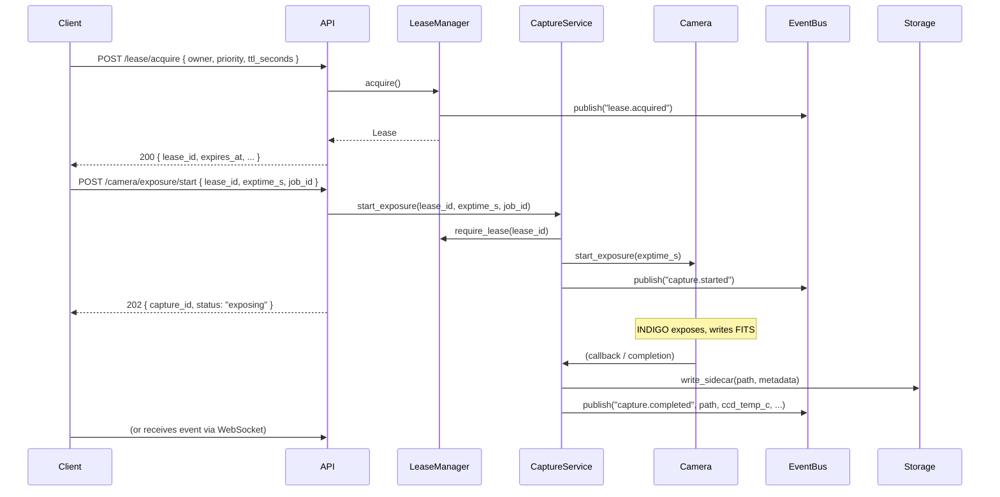
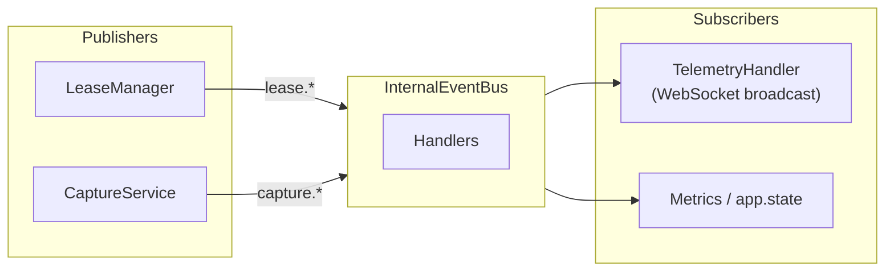
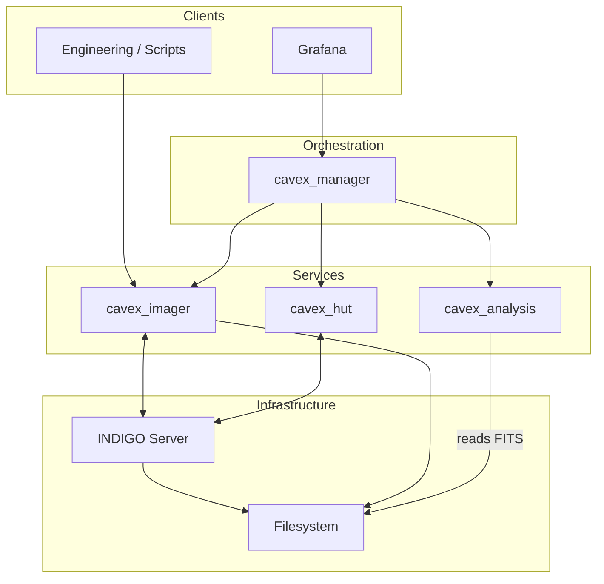

# CAVEX Imager — Service Overview

**Service:** `cavex_imager`  
**Version:** 1.0.0  
**Purpose:** Introduction for developers who need to understand, extend, or reuse this service as a base for similar camera-control services.

> **Viewing Mermaid diagrams:** The default Markdown preview in Cursor/VS Code does not render Mermaid. To see the diagrams:
> - **Option A:** Install the [Markdown Preview Mermaid Support](https://marketplace.visualstudio.com/items?itemName=bierner.markdown-mermaid) extension, then open the preview again (e.g. `Ctrl+Shift+V` / `Cmd+Shift+V`).
> - **Option B:** Push the repo to GitHub and open this file there; GitHub renders Mermaid in `.md` files.
> - **Option C:** Copy a ` ```mermaid ` code block into [Mermaid Live Editor](https://mermaid.live/) to view or export as image.

---

## 1. What is CAVEX Imager?

**CAVEX Imager** is a REST + WebSocket microservice that controls an astronomical camera via the [INDIGO](http://www.indigo-astronomy.org/) protocol. It is part of the CAVEX_V2 project (atmospheric extinction monitor at Calar Alto Observatory).

The service provides:

- **Camera control**: Connect/disconnect device, set ROI, binning, cooler, exposure time.
- **Image capture**: Single exposures and periodic sequences; abort in progress.
- **Concurrency**: Priority-based **lease** system so only one client can drive the camera at a time; higher-priority clients can preempt.
- **Storage**: Session paths, FITS files written by INDIGO, and **sidecar JSON** metadata (acquisition, thermal, context).
- **Telemetry**: WebSocket stream (1–2 Hz) with camera state and discrete events (capture started/done/failed, lease acquired/released).
- **Observability**: Health/diag endpoints, Prometheus metrics, structured logging (JSON).

It is designed so that other services (e.g. an orchestrator or engineering UI) call the HTTP API and/or subscribe to the WebSocket; the service itself does not perform scientific analysis or night scheduling.

---

## 2. High-Level Architecture

The codebase follows **Clean Architecture**: domain at the centre, application use cases around it, infrastructure and presentation on the outside. Dependencies point **inward** (presentation → application → domain; infrastructure → domain).



**Layer roles:**

| Layer | Path | Role |
|-------|------|------|
| **Domain** | `src/domain/` | Business entities (Lease, Capture, ImageMetadata), ports (interfaces), domain events, exceptions. No framework or I/O. |
| **Application** | `src/application/` | Use cases: `CaptureService` (exposure lifecycle), `LeaseManager` (acquire/renew/release/preempt). Depends only on domain. |
| **Infrastructure** | `src/infrastructure/` | Implementations: INDIGO client + camera adapter, in-memory event bus, sidecar file writer. Implements domain ports. |
| **Presentation** | `src/presentation/` | HTTP routes (health, lease, camera, telemetry), WebSocket handler, schemas, error envelopes. Depends on application. |
| **Shared** | `src/shared/` | Config (YAML + env), logging, Prometheus metrics. Used by any layer. |

---

## 3. Main Components



- **LeaseManager**: Owns the single active lease; `acquire(owner, priority, ttl_seconds)`, `renew()`, `release()`. Publishes `lease.acquired`, `lease.renewed`, `lease.preempted`, `lease.released`. Higher priority can preempt (graceful or abort).
- **CaptureService**: Starts exposure (with lease check), handles completion/failure from adapter, writes sidecar, publishes `capture.started` / `capture.completed` / `capture.failed` / `capture.aborted`. Runs sequences (repeated exposures with interval).
- **IndigoCameraAdapter**: Implements `ICameraDevice`. Connects to INDIGO over TCP, keeps a local state cache updated by INDIGO property events, starts/aborts exposure, enables BLOB/local file path. Event-driven (no polling).
- **InternalEventBus**: In-memory pub/sub implementing `IEventPublisher`. Handlers are async; one failing handler does not block others.
- **SidecarWriter**: Implements `IStorage`. Validates paths, checks free disk space, writes sidecar JSON atomically (temp file + rename).

---

## 4. API Surface

### 4.1 REST Endpoints

| Area | Prefix | Main endpoints |
|------|--------|----------------|
| **Health** | `/api/v1` | `GET /health`, `GET /diag/summary`, `GET /diag/last_errors`, `GET /diag/metrics` (Prometheus) |
| **Lease** | `/api/v1/lease` | `POST /acquire`, `POST /renew`, `POST /release`, `GET /status` |
| **Camera** | `/api/v1/camera` | `POST /connect`, `POST /disconnect`, `POST /config`, `POST /local_mode`, `POST /exposure/start`, `POST /exposure/abort`, `POST /sequence/start`, `POST /sequence/stop`, `GET /state` |
| **Telemetry** | `/api/v1/ws` | WebSocket `WS /telemetry?rate_hz=1` (or `2`) |

When `auth.enabled` is true, API and WebSocket require header `X-API-Key`. Optional `X-Correlation-ID` is echoed in responses.

### 4.2 Typical Flow (Lease → Capture)



---

## 5. Event-Driven Behaviour

Domain events are used for telemetry and internal coordination:



**Event types:**

- **Lease:** `lease.acquired`, `lease.renewed`, `lease.preempted`, `lease.released`
- **Capture:** `capture.started`, `capture.completed`, `capture.failed`, `capture.aborted`

WebSocket clients receive snapshots (camera state, disk, etc.) at the configured rate and discrete `capture_event` / `lease_event` messages when these events occur.

---

## 6. Configuration

Configuration is loaded from YAML (`config/default.yaml`, overridable by `config/production.yaml`) and environment variables (e.g. `CAVEX_*`). Main sections:

| Section | Purpose |
|---------|---------|
| `service` | name, version, log_level |
| `indigo` | host, port, device_name, reconnect (enabled, max_attempts, backoff_max_s) |
| `auth` | enabled, keys (list of { key, description }) |
| `lease` | preempt_mode (graceful \| abort), default_ttl_seconds, max_ttl_seconds |
| `storage` | host_base_path, container_base_path, min_free_gb, default_file_prefix, default_naming_pattern |
| `telemetry` | default_rate_hz, max_ws_clients |
| `logging` | stdout (enabled, format), file (enabled, path, max_bytes, backup_count, compress) |

See `config/default.yaml` and `src/shared/config.py` for the full shape and dot-notation access (`config.get("indigo.host")`).

---

## 7. Extension and Reuse

### 7.1 Using as a Base for Another Camera Service

- **Domain**: Keep or adapt `Lease`, `Capture`, `ImageMetadata`; ports `ICameraDevice`, `IStorage`, `IEventPublisher` (and optionally `ITelemetryPublisher`) define the contracts.
- **Application**: `LeaseManager` and `CaptureService` are independent of INDIGO; you can keep them and swap the camera implementation.
- **Infrastructure**: Replace `IndigoCameraAdapter` with an adapter for another driver/API that implements `ICameraDevice` (connect, disconnect, set_config, set_local_mode, start_exposure, abort_exposure, get_state).
- **Presentation**: Reuse routes and WebSocket pattern; adjust schemas and tags if the API surface diverges.

### 7.2 Adding New Endpoints or Events

- **New REST route**: Add a router under `src/presentation/api/routes/`, depend on `get_capture_service`, `get_lease_manager`, etc. (see `src/presentation/api/dependencies.py`). Keep validation in Pydantic schemas.
- **New domain event**: Publish via `IEventPublisher.publish(event_type, payload)`. Subscribe in `main.py` lifespan (e.g. to push to telemetry or update `app.state`).
- **New metric**: Add counter/gauge/histogram in `src/shared/observability.py` and update where the event occurs.

### 7.3 Replacing the Event Bus

`InternalEventBus` is an in-memory implementation of `IEventPublisher`. For multi-instance or persistence, implement `IEventPublisher` with a message broker (e.g. Redis, RabbitMQ) and inject it in the lifespan where the current `InternalEventBus()` is created.

### 7.4 Replacing Storage

`SidecarWriter` implements `IStorage` (validate_path, check_disk_space, write_sidecar). For different storage backends (object store, different metadata format), implement the same port and inject it into `CaptureService`.

---

## 8. Project Layout (Summary)

```
cavex_imager/
├── config/
│   ├── default.yaml
│   └── production.yaml
├── src/
│   ├── main.py                 # FastAPI app, lifespan, middleware, router includes
│   ├── domain/
│   │   ├── models/             # Lease, Capture, ImageMetadata
│   │   ├── ports/              # ICameraDevice, IStorage, IEventPublisher, ITelemetryPublisher
│   │   ├── events/             # (event payloads / types)
│   │   └── exceptions/         # Lease*, Capture* exceptions
│   ├── application/
│   │   ├── services/           # CaptureService, LeaseManager
│   │   └── dtos/               # Request/response DTOs
│   ├── infrastructure/
│   │   ├── adapters/           # indigo_client, indigo_camera_adapter
│   │   ├── bus/                # internal_event_bus
│   │   └── persistence/        # sidecar_writer
│   ├── presentation/
│   │   ├── api/                # routes, schemas, dependencies, errors
│   │   └── websocket/          # telemetry_handler
│   └── shared/                 # config, logging, observability
├── tests/
│   ├── unit/
│   └── integration/
├── docs/                       # This file, specs, INDIGO design
├── pyproject.toml
└── README.md
```

---

## 9. Context in the CAVEX_V2 Ecosystem



- **cavex_imager**: Camera control and acquisition (this service).
- **cavex_manager**: Orchestration; calls imager (and others) for sequences and scheduling.
- **cavex_analysis**: Reads FITS (and sidecars) for photometry/extinction.
- **cavex_hut**: Hut control (separate service).

For more detail on requirements and design, see:

- `docs/CAVEX_IMAGER_Architecture_Spec_v1.3.md`
- `docs/CAVEX_IMAGER_Technical_Spec_v1.3.md`
- `AGENTS.md` (development and AI-agent rules)
